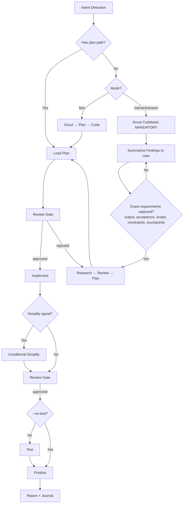

# Cook - Smart Feature Implementation

End-to-end implementation with automatic workflow detection.

**Principles:** YAGNI, KISS, DRY | Token efficiency | Concise reports

## Usage

```
/mk:cook <natural language task OR plan path>
```

**IMPORTANT:** If no flag is provided, the skill will use the `interactive` mode by default for the workflow.

**Optional flags to select the workflow mode:** 
- `--interactive`: Full workflow with user input (**default**)
- `--fast`: Skip research, scout→plan→code
- `--parallel`: Multi-agent execution
- `--no-test`: Skip testing step
- `--auto`: Auto-approve low-risk steps; high-risk changes stop for human approval before finalize/commit/ship. Controlled by `CK_AUTO_RESPONSE_TIMEOUT` env var (default 120s).

**Environment variables:**
- `CK_AUTO_RESPONSE_TIMEOUT`: Seconds to wait for user response in `--auto` mode before reverting. Default: 120. Implementation: read `process.env.CK_AUTO_RESPONSE_TIMEOUT`, parse as integer. If undefined/null → 120. If NaN or negative → 120. If 0 → no timeout (wait indefinitely). When escalation times out: revert via `git reset --soft HEAD~1` and log `[AUTO-TIMEOUT-USER] Reverted due to no user response within ${timeout}s`. Use distinct tag `[AUTO-TIMEOUT-REVIEW]` when a reviewer subagent times out (see Subagent Timeout Policy).

**Composable flags** (combine with any mode):
- `--tdd`: Tests-first per phase — write tests for current behavior before
  refactoring, then verify they still pass after the implementation step

**`--tdd` + `--auto` interaction:** When both flags are active, TDD verification failure (Step 3.V — tests broken after refactor) is always treated as HIGH-RISK and triggers mandatory human review, regardless of auto mode. TDD verification failures are never auto-fixed. In `--auto` mode, TDD failure immediately reverts changes and aborts the phase — do NOT call `AskUserQuestion` (non-interactive). Log `[AUTO-TDD-FAIL] Reverted due to TDD verification failure`. The phase is abandoned; workflow proceeds to next phase or halts. TDD failures indicate the refactor broke existing behavior and require human judgment. For side-effect escalations in --auto: always revert (safest default). Shim/update/accept options require human judgment and are NOT reachable in --auto mode.

**Example:**
```
/mk:cook "Add user authentication to the app" --fast
/mk:cook path/to/plan.md --auto
/mk:cook "Refactor auth middleware" --tdd
```

<HARD-GATE>
Do NOT write implementation code until a plan exists and has been reviewed.
This applies regardless of task simplicity. "Simple" tasks are where unexamined assumptions waste the most time.
Exception: `--fast` mode skips research but still requires a plan step.
User override: If user explicitly says "just code it" or "skip planning", map to `--fast` mode (which still requires a plan step). Do NOT bypass the plan requirement.
</HARD-GATE>

<HARD-GATE-SCOUT-FIRST>
Before planning OR asking clarifying questions, scan the codebase. Mandatory scout outputs:
1. Project type, language(s), framework(s)
2. Existing modules/files relevant to the task
3. Current patterns/conventions for similar features (so the implementation matches them)
4. Existing docs in `./docs/` and any in-flight plans in `./plans/` covering this area
5. Public APIs, schemas, contracts that the task could affect

State a 3-6 bullet codebase-context summary to the user before asking questions. Skip ONLY when input is a `plan.md`/`phase-*.md` path (the plan already encodes scout output).

Scout timeout: 60s. If scout fails or times out, fall back to inline `find`/`grep` for mandatory outputs. If scout returns empty results, log `[SCOUT-WARN] Empty results — proceeding with degraded context` and continue with inline discovery.
</HARD-GATE-SCOUT-FIRST>

<HARD-GATE-EXACT-REQUIREMENTS>
Before producing a plan, you MUST be able to answer ALL of these in one concrete sentence each (use `AskUserQuestion` to pin them down — do NOT proceed on vague intent):

1. **Expected output**: the concrete artifact(s) the user will see at the end (file paths, feature behavior, UI screen, API endpoint + payload, CLI command + flags).
2. **Acceptance criteria**: specific behaviors / inputs → outputs / edge cases that MUST work to call it "done".
3. **Scope boundary**: what is explicitly OUT of scope this round.
4. **Non-negotiable constraints**: stack, file locations, naming, backward compatibility, deadlines, performance.
5. **Touchpoints**: which existing files/modules (from scout) will be modified or extended; which contracts must stay stable.

Ground every `AskUserQuestion` option in scout findings (e.g., "Add to `src/api/users.ts` (matches existing pattern) or new `src/api/profile.ts`?"). Skip ONLY when input is a `plan.md`/`phase-*.md` path.
</HARD-GATE-EXACT-REQUIREMENTS>

<HARD-GATE-FILE-OWNERSHIP>
In parallel mode, DO NOT spawn agents until file ownership matrix is validated with zero overlap.
If overlap detected: merge to sequential or extract shared files into a pre-phase.
If phase files lack explicit file lists: fall back to sequential execution for those phases only — phases WITH file lists can still run in parallel.
See `references/workflow-steps.md` for full validation procedure.
</HARD-GATE-FILE-OWNERSHIP>

<HARD-GATE-NO-SIDE-EFFECTS>
Implementation is NOT done until verified to be side-effect-free. Code-review and test gates MUST prove:

1. New behavior matches every acceptance criterion above.
2. All tests pass — including tests in modules that share files/contracts with the change.
3. No existing business logic / workflow regression: explicitly walk each touchpoint and any caller of changed functions.
4. No new lint/type/build errors anywhere in the repo.
5. Public contracts unchanged unless intentional and called out (function signatures, exported types, API responses, DB schemas, env vars, config keys).

User override: If user invoked `--no-test`, item 2 is downgraded to a warning. Surface the unverified-tests risk in the finalize `AskUserQuestion` so the user accepts the trade-off rather than having it silently chosen. Items 1, 3, 4, 5 remain enforceable via the mandatory `code-reviewer` subagent.

If review/testing reveals a side effect, regression, or broken workflow, STOP. Use `AskUserQuestion` to present:
- What broke (file, test, workflow, user-facing behavior)
- Why this implementation caused it (1-line cause)
- 2-4 concrete options for the user to choose, e.g.:
  - "Revert this slice and re-plan with stricter scope"
  - "Keep the implementation and update <dependents> to match the new contract"
  - "Add a compatibility shim at <boundary> so old callers keep working"
  - "Accept the regression — old behavior was unintended/buggy"

Let the user decide. Do not silently patch around regressions.
</HARD-GATE-NO-SIDE-EFFECTS>

## Anti-Rationalization

| Thought | Reality |
|---------|---------|
| "This is too simple to plan" | Simple tasks have hidden complexity. Plan takes 30 seconds. |
| "I already know how to do this" | Knowing ≠ planning. Write it down. |
| "Let me just start coding" | Undisciplined action wastes tokens. Plan first. |
| "The user wants speed" | Fastest path = plan → implement → done. Not: implement → debug → rewrite. |
| "I'll plan as I go" | That's not planning, that's hoping. |
| "Just this once" | Every skip is "just this once." No exceptions. |

## Smart Intent Detection

| Input Pattern | Detected Mode | Behavior |
|---------------|---------------|----------|
| Path to `plan.md` or `phase-*.md` | code | Execute existing plan |
| Contains "fast", "quick" | fast | Skip research, scout→plan→code |
| Contains "trust me", "auto" | auto | Auto-approve low-risk artifact-validated steps; stop on high-risk |
| Lists 3+ features OR "parallel" | parallel | Multi-agent execution |
| Contains "no test", "skip test" | no-test | Skip testing step |
| Default | interactive | Full workflow with user input |

See `references/intent-detection.md` for detection logic.

## Process Flow (Authoritative)



**This diagram is the authoritative workflow.** Prose sections below provide detail for each node. If prose conflicts with this flow, follow the diagram.

## Workflow Overview

```
[Intent Detection] → [Research?] → [Review] → [Plan] → [Review] → [Implement] → [Conditional Simplify?] → [Review] → [Test?] → [Review] → [Finalize]
```

**Default (non-auto):** Stops at `[Review]` gates for human approval before each major step.
**Auto mode (`--auto`):** Skips human review gates only for low-risk work. High-risk changes stop for human approval before finalize/commit/ship.
**Claude Tasks:** Utilize `TaskCreate`, `TaskUpdate`, `TaskGet`, `TaskList` during implementation step. **Fallback (VSCode / no Task tools):**
- Progress tracking: use `TodoWrite` instead of `TaskCreate`/`TaskUpdate`
 **Dependency preservation:** When falling back to TodoWrite, encode dependency metadata in the task content: `[blocked-by: task-id]`. Parse this when marking tasks complete to enforce ordering. Log: `[TODO-WRITE] Dependencies encoded in content field — Task tools unavailable.`
**TodoWrite self-error fallback (tertiary):** If TodoWrite also errors (I/O failure, JSON parse error, disk full), this is the third consecutive failure mode.
- Interactive: escalate to user — `[TODO-WRITE] Progress tracker unavailable — manual intervention required`. Halt workflow; do NOT proceed without progress tracking.
- Auto: log error to `{planDir}/todo-tracker-error.log` with timestamp and error detail, then abort the current phase.
Triple-failure = Task tools failed → TodoWrite fallback → TodoWrite also failed. Never proceed with untracked progress.
- **blocked-by parser (TodoWrite mode):** When encoding dependencies in TodoWrite content, use `[blocked-by:task-id]` annotation. Parse this annotation when marking tasks complete to enforce ordering. Only tasks with no `[blocked-by:]` or whose blocked-by tasks are all marked complete may be started.
- Subagent delegation (Steps 4, 5, 6): invoke skills inline (`/mk:test`, `/mk:code-review`, `/mk:project-management`) instead of `Task()` spawning
- Validation: check skill invocations instead of Task tool calls

**Halt Semantics Glossary:** These terms have precise meanings — do NOT use interchangeably.
- `halt` = stop the entire workflow immediately. No further steps execute. User must explicitly resume.
- `abort` = stop the current phase/step only. Workflow proceeds to the next phase or halts based on context. See `references/workflow-steps.md` line 15 for double-failure protocol.
- `proceed to next phase` = skip current phase entirely and continue workflow at the next phase. Used when a phase is abandoned due to unrecoverable error.
- `escalate` = surface the issue to the user for decision. Does not itself stop the workflow — the user's response determines the next action.

**Double-failure fallback:** If both Task() AND inline skill invocation fail, escalate to user: "Cannot delegate Step N — manual intervention required." In --auto mode: log error and abort the current phase.

| Mode | Research | Testing | Review Gates | Phase Progression |
|------|----------|---------|--------------|-------------------|
| interactive | ✓ | ✓ | **User approval at each step** | One at a time |
| auto | ✓ | ✓ | Auto only if artifacts pass and high-risk stop is false | All low-risk phases continuously |
| fast | ✗ | ✓ | **User approval at each step** | One at a time |
| parallel | Optional | ✓ | Auto-approval per agent; artifact validation before commit | Parallel groups with per-agent gates |
| no-test | ✓ | ✗ | **User approval at each step** | One at a time |
| code | ✗ | ✓ | **User approval at each step** | Per plan |

## Flag Precedence

When multiple flags are present, precedence (highest to lowest):

1. `--interactive` (explicit mode)
2. `--no-test` (test gate override, applies within any mode)
3. `--fast` (skips research, still requires plan)
4. `--auto` (auto-approve low-risk)
5. `--parallel` (multi-agent execution)
6. `--tdd` (composable with any mode)

User override phrases ("just code it", "skip planning") map to `--fast` mode. They do NOT bypass the plan requirement.

`--auto --parallel` interaction: Each parallel agent's output is independently validated via artifacts before commit. `--auto` controls approval gates (not execution mode), so `--parallel` execution runs with per-agent auto-approval. If any agent's review-decision.json is not PASS: revert that agent's work; others continue. High-risk agents halt for human approval regardless of --auto.

## Step Output Format

```
✓ Step [N]: [Brief status] - [Key metrics]
```

## Blocking Gates (Non-Auto Mode)

Human review required at these checkpoints (skipped with `--auto`):
- **Post-Research:** Review findings before planning
- **Post-Plan:** Approve plan before implementation
- **Post-Implementation:** Approve code before testing
- **Post-Testing:** 100% pass + approve before finalize

**Always enforced (all modes):**
- **Testing:** 100% pass required (unless no-test mode)
- **Code Review (MANDATORY):** Spawn `code-reviewer` subagent with explicit checks:
  (a) every acceptance criterion met,
  (b) no regression to business logic in touchpoints/blast-radius,
  (c) no breaking changes to public contracts (signatures, schemas, APIs, env vars) unless called out,
  (d) follows existing patterns from scout,
  (e) no new lint/type/build errors anywhere.
  Pass scout summary + acceptance criteria as context. If reviewer flags side effects → trigger HARD-GATE-NO-SIDE-EFFECTS (`AskUserQuestion` with 2-4 options).
  Then: User approval OR artifact-gated auto approval. Score is advisory; it never approves by itself.

**Partial artifact guard:** Before treating an artifact as valid, verify required fields are present: `decision`, `score`, `criticalCount`, `createdAt`. If any required field is missing: treat identical to empty result (revert + log + proceed/halt). Do NOT auto-approve partial artifacts. Log `[AUTO-REVIEW] Partial artifact — missing fields: [list]`.

- **Finalize (MANDATORY - never skip):**
  1. **Activate `/mk:project-management` skill (MANDATORY)** → run full plan sync-back across ALL `phase-XX-*.md` (not only current phase), update `plan.md` status/progress, hydrate Claude Tasks, generate progress report
  2. `docs-manager` subagent → update `./docs` if changes warrant
  3. `TaskUpdate` → mark all Claude Tasks complete after sync-back verification (skip if Task tools unavailable)
  4. Ask user if they want to commit via `git-manager` subagent
  5. Run `/mk:journal` to write a concise technical journal entry upon completion

## Required Subagents (MANDATORY)

| Phase | Subagent | Requirement |
|-------|----------|-------------|
| Research | `researcher` | Optional in fast/code |
| Scout | `ck:scout` | Optional in code |
| Plan | `planner` | Optional in code |
| UI Work | `ui-ux-designer` | If frontend work |
| Testing | `tester`, `debugger` | **MUST** spawn |
| Review | `code-reviewer` | **MUST** spawn |
| Finalize | `/mk:project-management` skill + `docs-manager`, `git-manager` subagents | **MUST** invoke all |

## Subagent Timeout Policy

All mandatory subagents have timeouts. If a subagent exceeds its timeout, treat as failure and escalate.

| Subagent | Timeout | On timeout |
|----------|---------|------------|
| code-reviewer | 5 min | Treat as review failure; escalate |
| tester | 10 min | Treat as test failure; escalate |
| debugger | 15 min | Treat as debug failure; escalate — write `{planDir}/debugger-report.md` and escalate |
| docs-manager | 5 min | Skip docs update; log warning |
| git-manager | 5 min | Skip commit; log warning |
| user escalation | CK_AUTO_RESPONSE_TIMEOUT | Treat as timeout; log [AUTO-TIMEOUT-USER] |

**Timeout enforcement rule:** When spawning any mandatory subagent, compute `effectiveTimeout = Math.min(subagentTimeoutMs, parseInt(CK_AUTO_RESPONSE_TIMEOUT || '120') * 1000)`. If `CK_AUTO_RESPONSE_TIMEOUT` is `0`, the configured value is `0` — treat as "no global limit" and use `subagentTimeoutMs` directly (do NOT pass `0` to `Math.min`, which would zero out the effective timeout). Implementation: `raw = parseInt(process.env.CK_AUTO_RESPONSE_TIMEOUT || '120'); const globalMs = raw === 0 ? Infinity : raw * 1000; const effectiveTimeout = Math.min(subagentTimeoutMs, globalMs);`. If `NaN` or negative → 120000ms. The effective timeout is passed to the Task spawn. Never allow a subagent to run longer than CK_AUTO_RESPONSE_TIMEOUT.

**CRITICAL ENFORCEMENT:**
- Steps 4, 5, 6 **MUST** delegate — DO NOT implement testing, review, or finalization yourself
- **Primary:** Use Task tool to spawn subagents: `Task(subagent_type="[type]", prompt="[task]", description="[brief]")`
- **Fallback (Task tools unavailable):** Invoke skills inline: `/mk:test`, `/mk:code-review`, `/mk:project-management`

Mid-workflow gates (enforced before step transition):
- Before Step 4 (Test): Verify Step 4 subagent was invoked (Task call OR skill invocation). Check BOTH: Task tool call count AND skill invocation count for the step. If BOTH are zero: STOP. Log `[GATE] Step 4 (Test) subagent not invoked — workflow halted.` A failed Task call that errored out still counts as attempted, but verify the skill fallback was triggered if Task failed. In --auto mode: abort current phase and proceed to next (no user to resume).
- Before Step 5 (Review): Verify Step 5 subagent was invoked (Task call OR skill invocation). Check BOTH: Task tool call count AND skill invocation count for the step. If BOTH are zero: STOP. Log `[GATE] Step 5 (Review) subagent not invoked — workflow halted.` A failed Task call that errored out still counts as attempted, but verify the skill fallback was triggered if Task failed. In --auto mode: abort current phase and proceed to next (no user to resume).
- Before Step 6 (Finalize): Verify Steps 4 and 5 completed (Task call OR skill invocation). Check BOTH: Task tool call count AND skill invocation count for each step. If BOTH are zero for any prerequisite: STOP. Log `[GATE] Prerequisites not met — workflow halted.` In --auto mode: abort current phase and proceed to next (no user to resume).

**Unverified-tests gate:** If `--no-test` was active: the Finalize output MUST include `[COOK-WARN] Tests were skipped — verify manually before deploy`. This warning is part of the completion criteria — a Finalize without surfacing this warning when --no-test was active is INCOMPLETE.

Post-hoc check: If workflow ends with 0 Task calls AND 0 skill invocations for Steps 4/5/6, it is INCOMPLETE

## References

- `references/intent-detection.md` - Detection rules and routing logic
- `references/workflow-steps.md` - Detailed step definitions for all modes
- `references/review-cycle.md` - Interactive and auto review processes
- `references/subagent-patterns.md` - Subagent invocation patterns
- `../_shared/references/workflow-artifacts.md` - Review artifact schema and validator contract

## Workflow Position

**Typically follows:** `/mk:plan` (execute a plan), `/mk:brainstorm` (implement agreed solution)
**Typically precedes:** `/mk:code-review` (review after implementation), `/mk:test` (validate changes)
**Related:** `/mk:fix` (alternative for bug fixes), `/mk:plan` (create plan before cooking)
