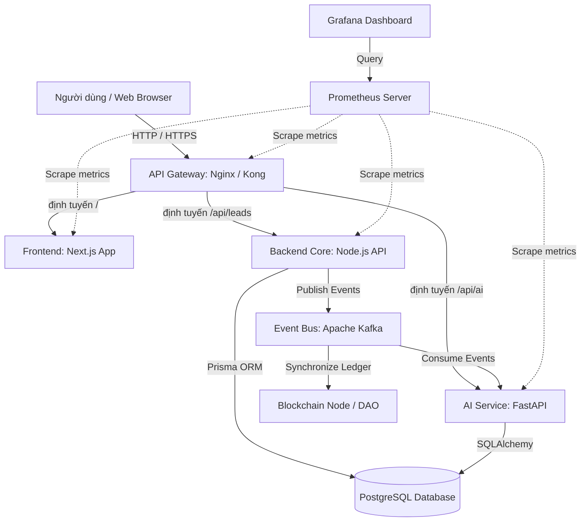

# Nhịp Điệu Xanh Integration & Deployment Orchestrator

Thư mục này chứa toàn bộ cấu hình hạ tầng dưới dạng mã (Infrastructure as Code - IaC), kịch bản kiểm thử tích hợp (E2E), và hệ thống giám sát (Monitoring) để tích hợp và vận hành 20 module của hệ sinh thái Proptech **Nhịp Điệu Xanh** lên môi trường Production.

---

## 1. Sơ đồ Kiến trúc Tích hợp (Integration Architecture)

Hệ thống sử dụng mô hình kết hợp giữa kiến trúc hướng dịch vụ (SOA) qua **API Gateway** và kiến trúc hướng sự kiện (EDA) qua **Apache Kafka Event Bus**:



---

## 2. Cấu trúc thư mục Orchestrator

```
apps/nhipdieuxanh-orchestrator/
├── docker/
│   ├── Dockerfile.frontend        # Next.js multi-stage build cho Frontend
│   ├── Dockerfile.backend         # Node.js Prisma build cho Backend Core
│   └── Dockerfile.ai              # Python FastAPI cho AI service
├── gateway/
│   └── nginx.conf                 # Cấu hình API Gateway định tuyến và bảo mật
├── helm/
│   └── nhipdieuxanh/
│       ├── Chart.yaml             # Metadata của Helm chart
│       ├── values.yaml            # Cấu hình biến môi trường và tài nguyên K8s
│       └── templates/             # Deployments, Services và Ingress manifest
├── mock-services/
│   └── ai-service/                # Mock AI Service viết bằng Python FastAPI
│       ├── main.py
│       └── requirements.txt
├── monitoring/
│   ├── prometheus.yml             # Cấu hình giám sát các Endpoint
│   └── grafana-dashboard.json     # Dashboard trực quan hóa hiệu năng hệ thống
├── tests/
│   └── e2e/
│       └── lead-flow.spec.ts      # Kịch bản kiểm thử E2E bằng Playwright
├── docker-compose.yml             # Khởi động toàn bộ hệ thống trên local bằng 1 lệnh
└── README.md                      # Tài liệu hướng dẫn vận hành (file này)
```

---

## 3. Hướng dẫn Khởi chạy Môi trường Phát triển (Local Development)

Bạn có thể chạy toàn bộ hệ thống Nhịp Điệu Xanh (bao gồm DB, Event Bus, Frontend, Backend, AI service, Gateway và Monitoring) chỉ với một lệnh duy nhất:

### Yêu cầu hệ thống:
- Đã cài đặt **Docker** và **Docker Compose**.

### Lệnh khởi chạy:
```bash
# Truy cập vào thư mục orchestrator
cd apps/nhipdieuxanh-orchestrator

# Khởi động tất cả các container chạy ngầm
docker-compose up -d --build
```

### Các đường dẫn truy cập mặc định:
- **Landing Page & App UI**: `http://localhost` (Đi qua API Gateway)
- **API Leads Ingestion**: `http://localhost/api/leads` (Đi qua API Gateway)
- **AI Microservice**: `http://localhost/api/ai/healthz` (Đi qua API Gateway)
- **Prometheus Dashboard**: `http://localhost:9090` (Công cụ thu thập metric)
- **Grafana Dashboard**: `http://localhost:3000` (Giao diện trực quan metrics, tài khoản mặc định `admin/admin`)

---

## 4. Cấu hình Production (Kubernetes & Helm)

Hệ thống được thiết kế để đóng gói và quản lý qua Helm Chart để triển khai lên Kubernetes Cluster (AWS EKS, Google GKE, hoặc Cloudflare).

### Triển khai thông qua Helm:
```bash
# Vào thư mục chứa chart
cd apps/nhipdieuxanh-orchestrator/helm

# Kiểm tra cú pháp template của chart
helm template ndx-release ./nhipdieuxanh

# Tiến hành cài đặt / cập nhật ứng dụng lên production cluster
helm upgrade --install ndx-prod ./nhipdieuxanh \
  --namespace ndx-prod --create-namespace \
  --values ./nhipdieuxanh/values.yaml
```

---

## 5. Tự động hóa CI/CD (GitHub Actions)

Quy trình tự động hóa được thiết lập tại file cấu hình `.github/workflows/deploy.yml` tại thư mục gốc của monorepo.

### Luồng CI/CD hoạt động:
1. **Kiểm thử liên tục (CI)**: Tự động chạy Lint và Unit Test / Build Check khi có Pull Request gửi vào nhánh `main`.
2. **Đóng gói container**: Sau khi merge vào `main`, tự động build Docker Image cho cả 3 microservice và đẩy lên Docker Registry.
3. **Triển khai tự động lên Staging**: Tự động cập nhật phiên bản app mới lên Kubernetes Staging namespace `ndx-staging`.
4. **Triển khai Production an toàn**: Sử dụng GitHub Environments để thiết lập kiểm duyệt thủ công (Manual Gate). Chỉ khi Lead DevOps phê duyệt, Helm mới thực hiện cập nhật Rolling Update lên production namespace `ndx-prod` để loại bỏ thời gian chết (Zero Downtime).

---

## 6. Kịch bản Kiểm thử End-to-End (E2E)

Playwright E2E test được viết để tự động giả lập hành vi người dùng trên trình duyệt:

### Cách chạy kiểm thử cục bộ:
```bash
# Cài đặt Playwright nếu chưa có
npm install -g @playwright/test

# Chạy test E2E cho luồng đăng ký leads
npx playwright test tests/e2e/lead-flow.spec.ts --project=chromium --headed
```
Kịch bản test tự động điền họ tên, số điện thoại, nhu cầu, ngân sách của leads, nhấn nút gửi, và xác nhận kết quả lưu vào database thông qua API thành công.

---

## 7. Kiểm thử hiệu năng (Performance Testing with k6)

Để đảm bảo hệ thống có khả năng chịu tải cao (tối thiểu 10.000 người dùng đồng thời), kịch bản load test bằng `k6` đã được xây dựng tại:
`tests/performance/load-test.js`.

### Cách chạy kiểm thử cục bộ:
```bash
# Cài đặt k6 (macOS)
brew install k6

# Chạy load test giả lập tăng dần tải lên 10,000 VUs hướng tới API Gateway local
k6 run tests/performance/load-test.js

# Chạy load test hướng tới staging
k6 run -e GATEWAY_URL=https://staging.nhipdieuxanh.vn tests/performance/load-test.js
```

---

## 8. Cấu hình Cảnh báo & Giám sát nâng cao (Alerting & Advanced Monitoring)

Bên cạnh Prometheus và Grafana, hệ thống đã được cấu hình Alertmanager để tự động gửi thông báo về Slack/Email và Promtail để thu thập log tập trung:

- **Prometheus Alerts (`monitoring/alerts.yml`)**: Định nghĩa các rule cảnh báo khi có sự cố nghiêm trọng (Lỗi API 500, Database Down, Hết ổ đĩa > 80%, API Latency cao p95 > 500ms).
- **Alertmanager (`monitoring/alertmanager.yml`)**: Cấu hình phân phối cảnh báo trực tiếp về kênh Slack `#nhipdieuxanh-alerts` và email trực ban `devops-team@nhipdieuxanh.vn`.
- **Promtail (`monitoring/promtail-config.yml`)**: Daemon thu thập log từ Docker containers và log file của Nginx Gateway để đẩy về Loki/Elasticsearch phục vụ phân tích.

---

## 9. Kế hoạch Ra mắt & Go-Live (Launch & Go-Live Plan)

Chi tiết danh sách kiểm tra kỹ thuật (Checklists) về Domain, SSL, Database Backup, cùng chiến lược phát hành từng bước (Private Beta -> Soft Launch -> Grand Launch) được ghi nhận đầy đủ tại file:
`docs/launch-plan.md`
