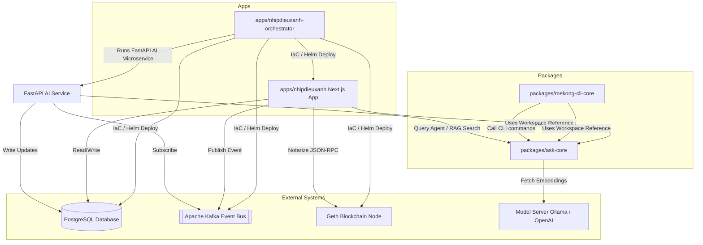
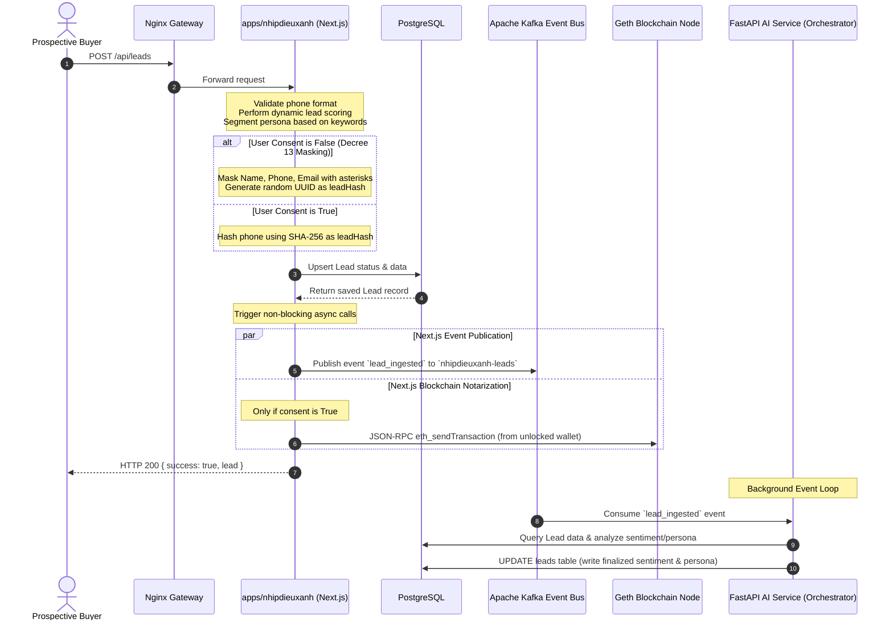
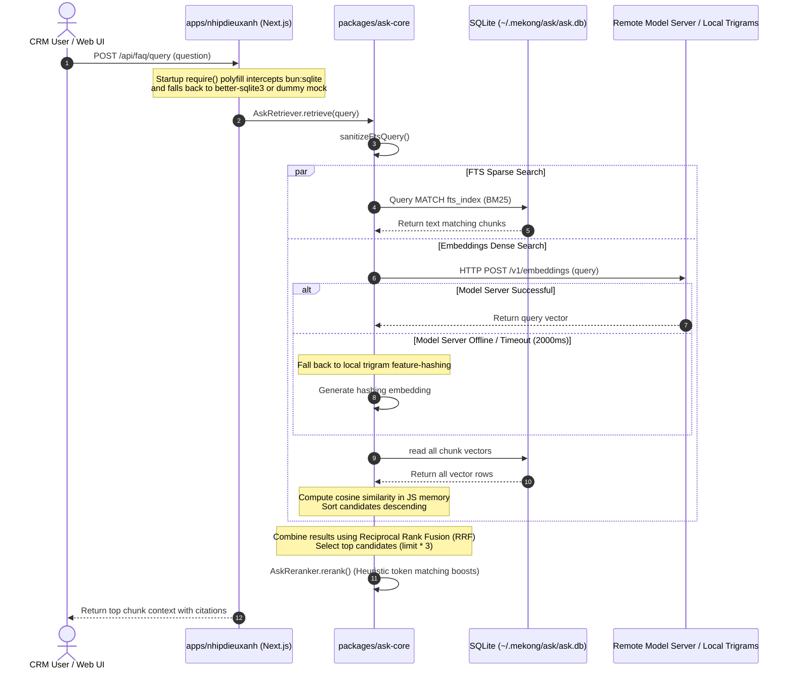
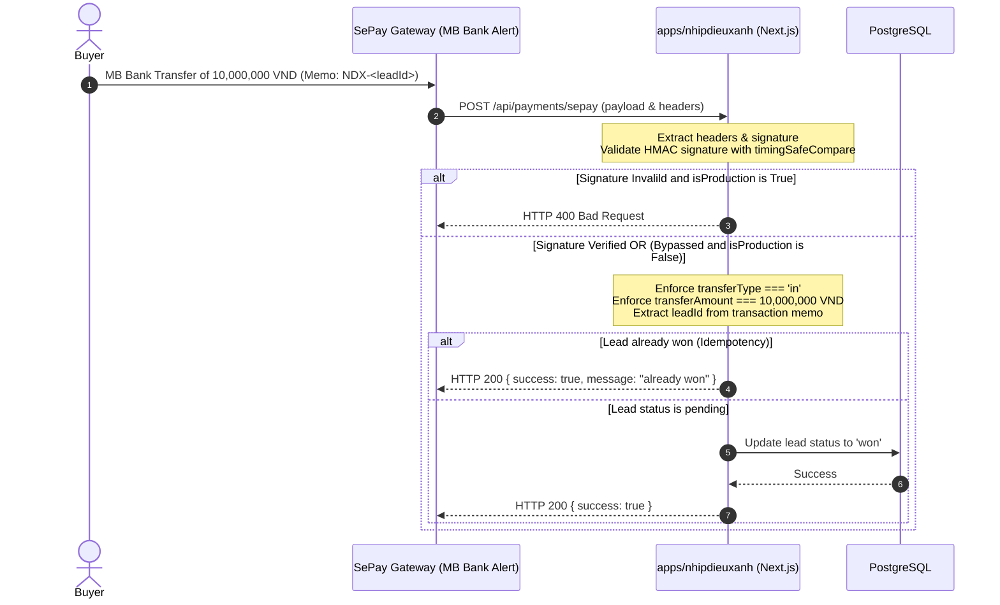

# Architecture Overview

This document describes the package dependency relationships, runtime data flows, and runtime processing steps across the `mekong-cli` monorepo.

---

## 1. Subsystem Dependency Relationships

The diagram below illustrates how internal packages/workspaces and external systems interact:

---

## 2. Runtime Data Flows

### A. Lead Ingestion Lifecycle

This sequence diagram depicts the flow when a new user registers as a lead, including scoring, masking (Decree 13 compliance), Kafka dispatch, blockchain notarization, and background AI processing.

---

## 3. RAG Retrieval Flow

This diagram describes how query requests are handled by `@mekong/ask-core`, leveraging SQLite FTS5 for BM25 keyword matching and dense vector similarity scoring with fallback feature hashing.

---

## 4. Payment Deposit Webhook Flow

This diagram describes how deposit bookings are processed using MB Bank/SePay HMAC signature-validated webhooks.

