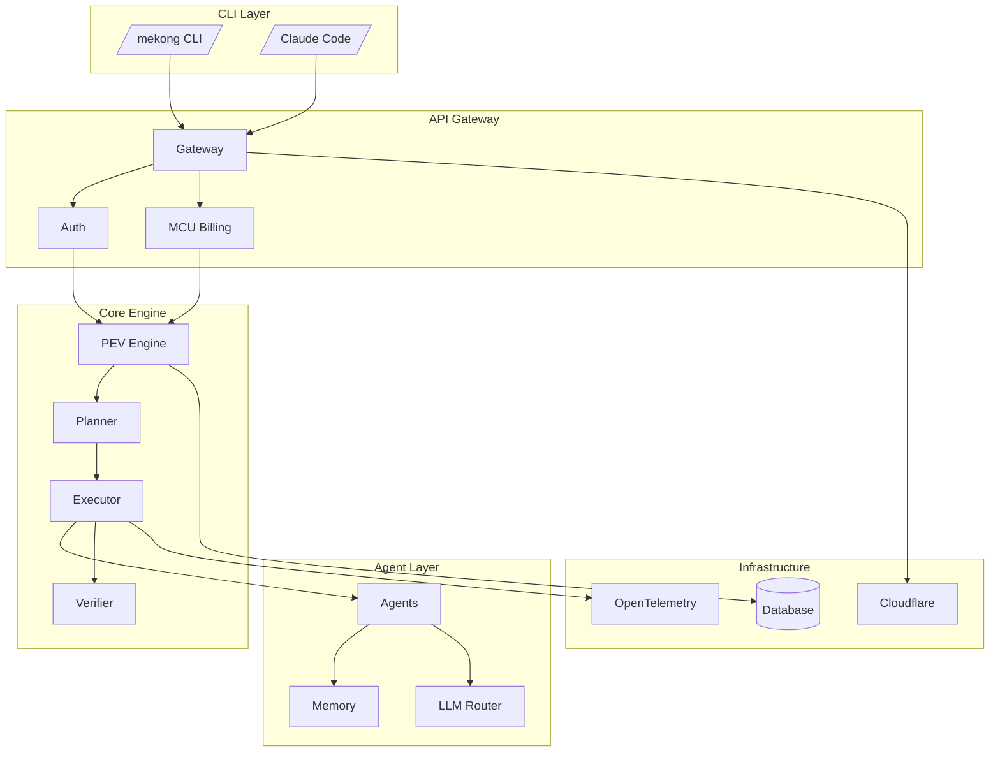
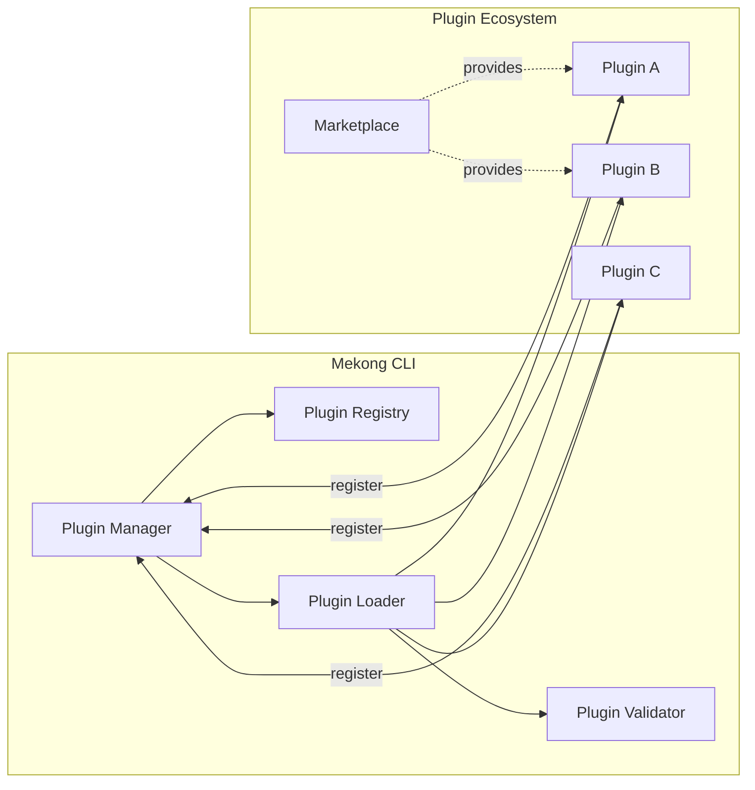
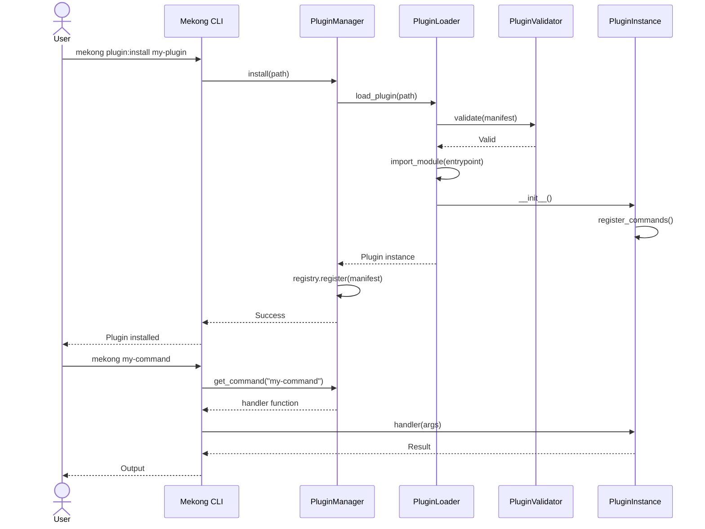
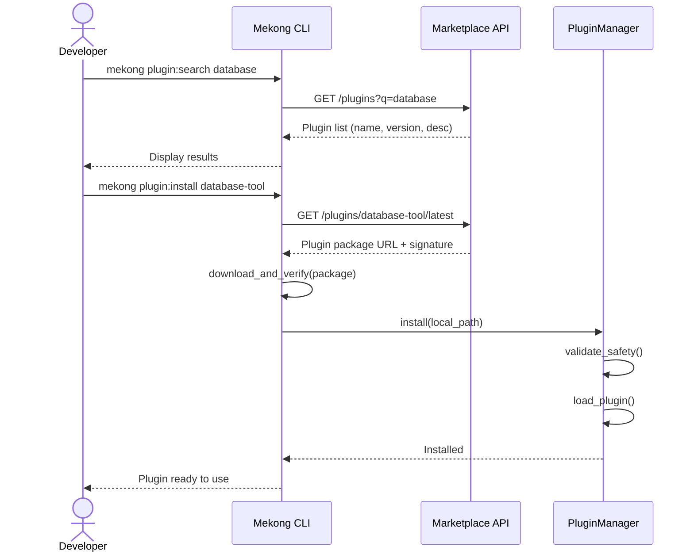
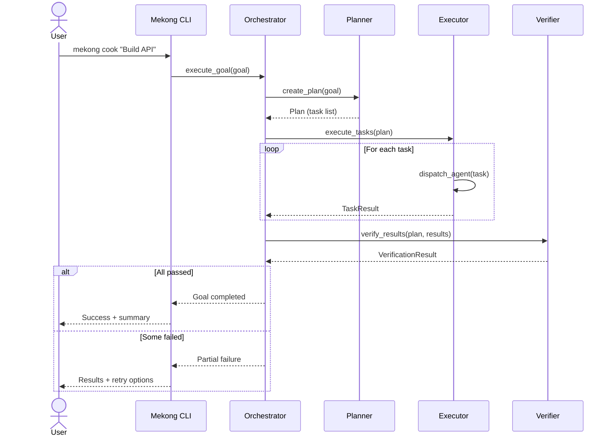

# Architecture Documentation Polish Plan

**Last Updated**: 2026-06-22  
**Status**: Implementation Plan  
**Owner**: Architecture Team  
**Target Completion**: 2026-06-30 (pre-GA)  

---

## 1. Objectives

Improve the quality, clarity, and comprehensiveness of architecture documentation with:

1. **Visual diagrams** for complex component interactions
2. **Sequence diagrams** for plugin lifecycle and critical flows
3. **ADR integration** with cross-linking to implementation
4. **Terminology consistency** across all architecture docs
5. **Enhanced cross-references** between related documents

---

## 2. Current State

### 2.1 Existing Architecture Documents

```
docs/architecture/
├── system-architecture.md          (Good - needs diagrams)
├── plugin-architecture.md          (Good - needs lifecycle seq)
├── adrs/
│   ├── ADR-011-project-configuration-architecture.md
│   ├── ADR-009-BRAIN-cognitive-architecture.md
│   ├── ADR-072-unified-llm-provider-architecture.md
│   ├── ADR-031-provider-adapter-architecture.md
│   ├── ADR-013-data-integrity-checkpoint-architecture.md
│   ├── ADR-019-canonical-logging-architecture.md
│   ├── ADR-004-typescript-first-architecture.md
│   ├── ADR-076-command-fabric-catalog-architecture.md
│   ├── ADR-055-agents-architecture-and-meta-agents.md
│   ├── ADR-015-multi-contributor-architecture.md
│   ├── ADR-020-session-architecture-cleanup.md
│   ├── ADR-033-provider-adapter-architecture.md
│   └── ... (more ADRs)
```

### 2.2 Identified Gaps

| Document | Missing | Priority |
|----------|---------|----------|
| system-architecture.md | Component interaction diagram | High |
| plugin-architecture.md | Plugin lifecycle sequence | High |
| plugin-architecture.md | Loading flow diagram | Medium |
| All ADRs | Cross-reference matrix | Medium |
| All architecture docs | Terminology glossary | Low |
| ADR index | Not comprehensive | Medium |

---

## 3. Phase 1: Mermaid Diagrams (Days 1-2)

### 3.1 system-architecture.md Enhancements

**Add at top of file** (after introduction):



**Add plugin system diagram**:



---

## 4. Phase 2: Sequence Diagrams (Days 3-4)

### 4.1 Plugin Lifecycle Sequence

**File**: `docs/architecture/plugin-lifecycle-sequence.md` (new)



### 4.2 Plugin Discovery & Installation Flow



### 4.3 PEV Engine Orchestration



---

## 5. Phase 3: ADR Integration & Cross-Linking (Days 5-6)

### 5.1 Create ADR Index

**File**: `docs/architecture/adr-index.md` (new)

**Content**:

```markdown
# Architecture Decision Records Index

This index provides a navigable map of all ADRs in the Mekong CLI project.

## ADRs by Category

### Plugin System
- [ADR-004: TypeScript-First Architecture](./ADR-004-typescript-first-architecture.md)
- [ADR-055: Agents Architecture and Meta-Agents](./ADR-055-agents-architecture-and-meta-agents.md)
- [ADR-076: Command Fabric Catalog Architecture](./ADR-076-command-fabric-catalog-architecture.md)

### Data & Persistence
- [ADR-011: Project Configuration Architecture](./ADR-011-project-configuration-architecture.md)
- [ADR-013: Data Integrity Checkpoint Architecture](./ADR-013-data-integrity-checkpoint-architecture.md)
- [ADR-019: Canonical Logging Architecture](./ADR-019-canonical-logging-architecture.md)
- [ADR-020: Session Architecture Cleanup](./ADR-020-session-architecture-cleanup.md)

### AI & LLM
- [ADR-009: BRAIN Cognitive Architecture](./ADR-009-BRAIN-cognitive-architecture.md)
- [ADR-031: Provider Adapter Architecture](./ADR-031-provider-adapter-architecture.md)
- [ADR-033: Provider Adapter Architecture (dup? check)](./ADR-033-provider-adapter-architecture.md)
- [ADR-072: Unified LLM Provider Architecture](./ADR-072-unified-llm-provider-architecture.md)

### Collaboration & Multi-Contributor
- [ADR-015: Multi-Contributor Architecture](./ADR-015-multi-contributor-architecture.md)

## ADRs by Decision Date

| Date | ADR | Title |
|------|-----|-------|
| (need to extract from file headers) | | |

## Related Documents

- [System Architecture](./system-architecture.md) - High-level system overview
- [Plugin Architecture](./plugin-architecture.md) - Plugin system design
- [Implementation Timeline](./implementation-timeline-matrix.md) - Phases and milestones
```

**Action**: Extract decision dates from ADR file headers to populate table.

### 5.2 Cross-Reference Enhancement

**In each ADR**, add section at bottom:

```markdown
## See Also

**Related ADRs**:
- [ADR-009](./ADR-009-BRAIN-cognitive-architecture.md) — BRAIN memory integration
- [ADR-055](./ADR-055-agents-architecture-and-meta-agents.md) — Agent coordination

**Implementation**:
- `src/core/planner.py` — Planner implementation
- `src/core/executor.py` — Executor implementation

**Documentation**:
- [System Architecture](./system-architecture.md) — Component overview
- [Plugin Architecture](./plugin-architecture.md) — Plugin integration points
```

**Process**:
1. For each ADR, identify 2-3 most related ADRs
2. Link to specific implementation files in `src/`
3. Link to user-facing documentation that uses this ADR

---

## 6. Phase 4: Terminology Consistency (Day 7)

### 6.1 Create Glossary

**File**: `docs/glossary.md` (new)

**Content**:

| Term | Definition | Context |
|------|------------|---------|
| Plugin | Modular extension to Mekong CLI with isolated commands | Plugin System |
| Command | CLI action invoked by user | Core |
| Manifest | JSON configuration file (`mekong-plugin.json`) | Plugin |
| PEV | Plan-Execute-Verify orchestration loop | Core Engine |
| MCU | Minimum Credit Unit — billing primitive | Billing |
| Particle | Identity unit replacing tenant (ZenOS) | ZenOS |
| Constitutional AI | 9-principle ethical review system | Governance |
| Marketplace | Plugin distribution platform | Ecosystem |
| ADR | Architecture Decision Record — documented rationale | Process |
| SDK | Software Development Kit — developer tools | Plugin |

### 6.2 Terminology Standards

**Use these terms consistently**:

| Concept | Preferred Term | Avoid |
|---------|----------------|-------|
| Modular extension | Plugin | Module, extension, addon |
| CLI action | Command | Subcommand, operation (except in code) |
| Configuration file | Manifest | Config, spec, definition |
| Core engine | PEV Engine | Orchestrator, planner, executor |
| Billing unit | MCU | Credit, point, token |
| Identity | Particle | User, tenant (legacy only) |
| Governance | Constitutional AI | Ethics, review system |

**Process**:
- Search/replace across all `docs/**/*.md`
- Use grep to find violations:
  ```bash
  grep -r "module\|extension" docs/ --include="*.md" | grep -v "Python module"
  grep -r "tenant" docs/ --include="*.md" | grep -v "legacy\|migration"
  ```

---

## 7. Phase 5: Cross-Reference Enhancement (Day 8)

### 7.1 Add "See Also" Sections

**To each architecture document**, add cross-links to:

- Related ADRs
- Implementation files
- User documentation
- External references (specs, RFCs, blog posts)

**Example template**:

```markdown
## See Also

**Related ADRs**:
- [ADR-009](./architecture/adrs/ADR-009-BRAIN-cognitive-architecture.md)

**Implementation**:
- [`src/core/memory.py`](../src/core/memory.py) — Memory storage
- [`src/agents/base.py`](../src/agents/base.py) — Agent base class

**User Documentation**:
- [Plugin Developer Guide](../plugin-developer-guide.md#memory-usage)
- [Troubleshooting](../troubleshooting.md#memory-leaks)

**External References**:
- [Vector Database Basics](https://example.com/vector-db-101)
- [Semantic Search Patterns](https://example.com/semantic-search)
```

### 7.2 Navigation Improvements

**Update `docs/README.md` or create `docs/index.md`**:

```markdown
# Mekong CLI Documentation

## Getting Started
- [Installation Guide](./installation.md)
- [Quickstart](./quickstart.md)
- [User Onboarding](./user-onboarding-flow.md)

## Core Concepts
- [System Architecture](./architecture/system-architecture.md)
- [Plugin System](./architecture/plugin-architecture.md)
- [PEV Engine](./autonomous-goal-engine.md)
- [Glossary](./glossary.md)

## Developer Guides
- [Plugin Developer Guide](./plugin-developer-guide.md)
- [API Reference](./plugin-api-reference.md)
- [Testing Guide](./testing-summary.md)
- [Contribution Guidelines](../CONTRIBUTING.md)

## Architecture
- [Architecture Overview](./architecture/system-architecture.md)
- [Architecture Decision Records](./architecture/adr-index.md)
- [ADR Process](./architecture/adr-process.md)

## Operations
- [Deployment Guide](./deployment-guide.md)
- [Security Hardening](./security-hardening.md)
- [Monitoring](./load-testing.md)
- [Troubleshooting](./troubleshooting.md)

## Business & GTM
- [GTM Strategy](./gtm-strategy.md)
- [Pricing Strategy](./pricing-strategy.md)
- [Marketplace Design](./marketplace-design/)
```

---

## 8. Phase 6: Documentation Quality Checklist (Days 9-10)

For each architecture document, verify:

### 8.1 Structure

- [ ] Has metadata header (title, lastUpdated, status, audience)
- [ ] Uses proper heading hierarchy (H2 → H3 → H4)
- [ ] Includes table of contents for docs > 200 lines
- [ ] Has "See Also" section with cross-references
- [ ] Diagrams labeled and explained

### 8.2 Content

- [ ] Technical accuracy verified against code
- [ ] All code examples tested and working
- [ ] All commands show expected output
- [ ] No placeholder text ("TODO", "FIXME", "...")
- [ ] All figures/images have captions

### 8.3 Interlinking

- [ ] All internal links point to existing files
- [ ] All external links use HTTPS
- [ ] No circular references without anchor links
- [ ] Related documents mentioned in "See Also"

### 8.4 Style

- [ ] Consistent terminology (use glossary terms)
- [ ] Active voice preferred
- [ ] Concise sentences (max 25 words average)
- [ ] No spelling or grammar errors
- [ ] Code blocks have language identifiers

---

## 9. Automation & Validation

### 9.1 Pre-commit Hook

`.git/hooks/pre-commit` (or via package):

```bash
#!/bin/bash
# Validate architecture docs before commit

echo "🔍 Checking architecture documentation..."

# Spell check
find docs/architecture -name "*.md" -exec codespell {} \;

# Link check (new or modified docs only)
changed_docs=$(git diff --cached --name-only --diff-filter=AM | grep '\.md$')
if [ -n "$changed_docs" ]; then
    echo "Checking links in modified docs..."
    npx markdown-link-check $changed_docs
fi

echo "✅ Architecture docs validation passed"
```

### 9.2 CI/CD Integration

`.github/workflows/arch-docs.yml`:

```yaml
name: Architecture Documentation
on:
  push:
    paths:
      - 'docs/architecture/**'
jobs:
  validate:
    runs-on: ubuntu-latest
    steps:
      - uses: actions/checkout@v4
      - name: Spell check
        run: |
          find docs/architecture -name "*.md" -exec codespell {} \;
      - name: Link check
        run: |
          npx markdown-link-check docs/architecture/**/*.md
      - name: Mermaid diagram validation
        run: |
          # Check all mermaid code blocks have closing ```
          grep -c '```mermaid' docs/architecture/**/*.md
          grep -c '```' docs/architecture/**/*.md
```

---

## 10. Review & Approval Process

Each polished document requires:

1. **Technical review** by architecture team lead
2. **Documentation review** by docs manager
3. **Stakeholder approval** (for major changes)

Review checklist:

- [ ] All diagrams render correctly in GitHub markdown preview
- [ ] No broken links (internal or external)
- [ ] All code examples tested
- [ ] Terminology consistent with glossary
- [ ] Cross-references complete and accurate
- [ ] No spelling/grammar errors
- [ ] Metadata present and correct

---

## 11. Success Metrics

| Metric | Target | Measurement |
|--------|--------|-------------|
| Documents with diagrams | 100% (critical ones) | File count |
| ADRs with cross-references | 100% | Automated check |
| Terminology consistency score | 95%+ | Spot check audit |
| Broken links | 0 | `markdown-link-check` |
| Documentation coverage | All ADRs documented | Checklist |
| Review turnaround | <3 days per doc | Lead time tracking |

---

## 12. Timeline Summary

| Day | Phase | Deliverable |
|-----|-------|-------------|
| 1-2 | Phase 1: Mermaid Diagrams | Updated system-architecture.md, plugin-architecture.md |
| 3-4 | Phase 2: Sequence Diagrams | New: plugin-lifecycle-sequence.md |
| 5-6 | Phase 3: ADR Integration | New: adr-index.md, enhanced ADRs |
| 7 | Phase 4: Terminology | New: glossary.md, terminology fixes |
| 8 | Phase 5: Cross-References | Updated "See Also" sections, index.md |
| 9-10 | Phase 6: QA & Polish | All docs validated, final review |

**Total**: 10 working days  
**Parallelizable**: Phases 1 and 2 can run in parallel (different documents)

---

## 13. Post-Polish Maintenance

To prevent documentation drift:

1. **Docs-as-code**: All changes via PR with review
2. **Automated checks**: Link validation on every PR
3. **Regular audits**: Quarterly completeness review
4. **Update triggers**: Code changes require doc updates (enforced in PR template)

---

**Next Step**: Begin Phase 1 (Mermaid Diagrams) with architecture team review of existing diagrams before creation.
