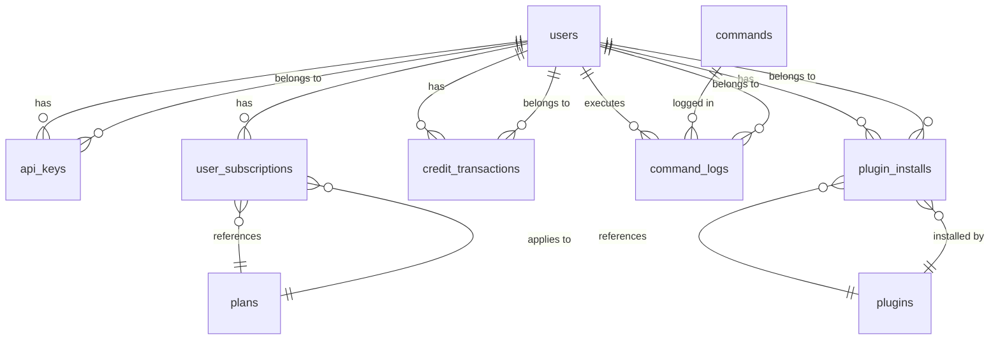

# Data Models - SME Agentic Platform

## Overview

This document defines the database schema for the SME Agentic Platform using PostgreSQL with SQLAlchemy Core. The schema supports user management, command registry, billing/credits, plugin system, and audit logging.

## Entity Relationship Diagram



## Schema Definition

### Users and Authentication

```sql
-- Users table: core user identity
CREATE TABLE users (
    id UUID PRIMARY KEY DEFAULT gen_random_uuid(),
    email VARCHAR(255) UNIQUE NOT NULL,
    name VARCHAR(255) NOT NULL,
    company_name VARCHAR(255),
    timezone VARCHAR(50) DEFAULT 'UTC',
    locale VARCHAR(10) DEFAULT 'en',
    created_at TIMESTAMPTZ DEFAULT NOW(),
    updated_at TIMESTAMPTZ DEFAULT NOW(),

    CONSTRAINT email_format CHECK (email ~* '^[A-Za-z0-9._%+-]+@[A-Za-z0-9.-]+\.[A-Za-z]{2,}$')
);

-- API keys for programmatic access (key_hash stores SHA256)
CREATE TABLE api_keys (
    id UUID PRIMARY KEY DEFAULT gen_random_uuid(),
    user_id UUID NOT NULL REFERENCES users(id) ON DELETE CASCADE,
    name VARCHAR(100) NOT NULL,
    key_hash VARCHAR(255) NOT NULL UNIQUE,
    key_prefix CHAR(8) NOT NULL, -- First 8 chars for lookup
    scopes JSONB DEFAULT '[]', -- Array of allowed command namespaces
    last_used_at TIMESTAMPTZ,
    expires_at TIMESTAMPTZ,
    created_at TIMESTAMPTZ DEFAULT NOW(),

    CONSTRAINT api_key_prefix_len CHECK (char_length(key_prefix) = 8)
);

CREATE INDEX idx_api_keys_user_id ON api_keys(user_id);
CREATE INDEX idx_api_keys_key_prefix ON api_keys(key_prefix);
CREATE INDEX idx_api_keys_last_used ON api_keys(last_used_at DESC);

-- User sessions (JWT revocation tracking)
CREATE TABLE sessions (
    id UUID PRIMARY KEY DEFAULT gen_random_uuid(),
    user_id UUID NOT NULL REFERENCES users(id) ON DELETE CASCADE,
    token_id UUID UNIQUE NOT NULL, -- JWT jti claim
    expires_at TIMESTAMPTZ NOT NULL,
    revoked BOOLEAN DEFAULT FALSE,
    created_at TIMESTAMPTZ DEFAULT NOW()
);

CREATE INDEX idx_sessions_user_id ON sessions(user_id);
CREATE INDEX idx_sessions_token_id ON sessions(token_id);
CREATE INDEX idx_sessions_expires_at ON sessions(expires_at);

-- User profile and preferences
CREATE TABLE user_profiles (
    user_id UUID PRIMARY KEY REFERENCES users(id) ON DELETE CASCADE,
    avatar_url TEXT,
    bio TEXT,
    preferences JSONB DEFAULT '{}',
    metadata JSONB DEFAULT '{}',
    updated_at TIMESTAMPTZ DEFAULT NOW()
);
```

### Command Registry

```sql
-- Command definitions: core + plugin commands
CREATE TABLE commands (
    name VARCHAR(255) PRIMARY KEY,
    category VARCHAR(50) NOT NULL,
    description TEXT NOT NULL,
    summary VARCHAR(200), -- One-line summary for listings
    plugin_id VARCHAR(255), -- NULL for core commands, references plugins.id
    credit_cost INTEGER NOT NULL DEFAULT 1,
    requires_approval BOOLEAN DEFAULT FALSE,
    timeout_seconds INTEGER NOT NULL DEFAULT 30,
    schema JSONB NOT NULL, -- Full JSON Schema for argument validation
    examples JSONB DEFAULT '[]', -- Array of {description, args}
    tags TEXT[] DEFAULT '{}',
    enabled BOOLEAN DEFAULT TRUE,
    created_at TIMESTAMPTZ DEFAULT NOW(),
    updated_at TIMESTAMPTZ DEFAULT NOW()
);

CREATE INDEX idx_commands_category ON commands(category);
CREATE INDEX idx_commands_plugin_id ON commands(plugin_id);
CREATE INDEX idx_commands_enabled ON commands(enabled) WHERE enabled = true;
CREATE INDEX idx_commands_tags ON commands USING GIN(tags);

-- Command aliases for backward compatibility
CREATE TABLE command_aliases (
    alias VARCHAR(255) PRIMARY KEY,
    command_name VARCHAR(255) NOT NULL REFERENCES commands(name) ON DELETE CASCADE,
    created_at TIMESTAMPTZ DEFAULT NOW()
);

CREATE INDEX idx_command_aliases_name ON command_aliases(command_name);
```

### Billing and Credits

```sql
-- Subscription plans
CREATE TABLE plans (
    id UUID PRIMARY KEY DEFAULT gen_random_uuid(),
    name VARCHAR(50) UNIQUE NOT NULL, -- 'starter', 'growth', 'pro'
    display_name VARCHAR(100) NOT NULL,
    description TEXT,
    monthly_credits INTEGER NOT NULL,
    price_cents INTEGER NOT NULL,
    currency VARCHAR(3) DEFAULT 'USD',
    stripe_price_id VARCHAR(255), -- Stripe price object ID
    polar_product_id VARCHAR(255), -- Polar product ID
    active BOOLEAN DEFAULT TRUE,
    created_at TIMESTAMPTZ DEFAULT NOW(),
    updated_at TIMESTAMPTZ DEFAULT NOW(),

    CONSTRAINT positive_credits CHECK (monthly_credits > 0),
    CONSTRAINT positive_price CHECK (price_cents > 0)
);

-- User subscriptions
CREATE TABLE user_subscriptions (
    id UUID PRIMARY KEY DEFAULT gen_random_uuid(),
    user_id UUID NOT NULL REFERENCES users(id) ON DELETE CASCADE,
    plan_id UUID NOT NULL REFERENCES plans(id),
    status VARCHAR(20) DEFAULT 'active', -- active, canceled, past_due, trialing
    current_balance INTEGER NOT NULL DEFAULT 0,
    last_renewal TIMESTAMPTZ,
    trial_ends_at TIMESTAMPTZ,
    canceled_at TIMESTAMPTZ,
    created_at TIMESTAMPTZ DEFAULT NOW(),
    updated_at TIMESTAMPTZ DEFAULT NOW(),

    UNIQUE(user_id, plan_id)
);

CREATE INDEX idx_user_subscriptions_user_id ON user_subscriptions(user_id);
CREATE INDEX idx_user_subscriptions_status ON user_subscriptions(status);
CREATE INDEX idx_user_subscriptions_balance ON user_subscriptions(current_balance);

-- Credit transaction ledger (immutable)
CREATE TABLE credit_transactions (
    id UUID PRIMARY KEY DEFAULT gen_random_uuid(),
    user_id UUID NOT NULL REFERENCES users(id),
    type VARCHAR(20) NOT NULL, -- deduction, allocation, refund, purchase, adjustment
    amount INTEGER NOT NULL, -- positive for credit, negative for deduction
    balance_after INTEGER NOT NULL, -- snapshot for reconciliation
    command_name VARCHAR(255), -- NULL for manual adjustments
    reference_id VARCHAR(255), -- external payment ID, charge ID
    metadata JSONB DEFAULT '{}',
    idempotency_key VARCHAR(255), -- Prevent double processing
    created_at TIMESTAMPTZ DEFAULT NOW()
);

CREATE INDEX idx_credit_transactions_user_id ON credit_transactions(user_id);
CREATE INDEX idx_credit_transactions_created_at ON credit_transactions(created_at DESC);
CREATE INDEX idx_credit_transactions_reference ON credit_transactions(reference_id) WHERE reference_id IS NOT NULL;
CREATE INDEX idx_credit_transactions_idempotency ON credit_transactions(idempotency_key) WHERE idempotency_key IS NOT NULL;

-- Payment webhooks log
CREATE TABLE payment_webhooks (
    id UUID PRIMARY KEY DEFAULT gen_random_uuid(),
    provider VARCHAR(50) NOT NULL, -- stripe, polar, sepay
    event_id VARCHAR(255) NOT NULL,
    event_type VARCHAR(100) NOT NULL,
    payload JSONB NOT NULL,
    processed BOOLEAN DEFAULT FALSE,
    processed_at TIMESTAMPTZ,
    error TEXT,
    created_at TIMESTAMPTZ DEFAULT NOW()
);

CREATE INDEX idx_payment_webhooks_provider_event ON payment_webhooks(provider, event_id);
CREATE INDEX idx_payment_webhooks_processed ON payment_webhooks(processed, created_at);
```

### Command Execution Audit

```sql
-- Command execution logs (primary audit trail)
CREATE TABLE command_logs (
    id UUID PRIMARY KEY DEFAULT gen_random_uuid(),
    user_id UUID NOT NULL REFERENCES users(id),
    command_name VARCHAR(255) NOT NULL,
    plugin_id VARCHAR(255),
    args JSONB NOT NULL,
    result JSONB,
    success BOOLEAN NOT NULL,
    error_type VARCHAR(100),
    duration_ms INTEGER NOT NULL,
    llm_tokens_used INTEGER,
    retry_count INTEGER DEFAULT 0,
    executed_at TIMESTAMPTZ DEFAULT NOW()
);

CREATE INDEX idx_command_logs_user_id ON command_logs(user_id);
CREATE INDEX idx_command_logs_executed_at ON command_logs(executed_at DESC);
CREATE INDEX idx_command_logs_command_name ON command_logs(command_name);
CREATE INDEX idx_command_logs_user_cmd_time ON command_logs(user_id, command_name, executed_at DESC);
CREATE INDEX idx_command_logs_plugin_id ON command_logs(plugin_id);

-- Detailed execution step logs (for PEV debugging)
CREATE TABLE execution_steps (
    id UUID PRIMARY KEY DEFAULT gen_random_uuid(),
    command_log_id UUID NOT NULL REFERENCES command_logs(id) ON DELETE CASCADE,
    step_number INTEGER NOT NULL,
    step_name VARCHAR(255) NOT NULL,
    tool VARCHAR(100) NOT NULL, -- llm, shell, api, etc.
    input JSONB,
    output JSONB,
    started_at TIMESTAMPTZ NOT NULL,
    completed_at TIMESTAMPTZ,
    duration_ms INTEGER,
    success BOOLEAN
);

CREATE INDEX idx_execution_steps_command_log ON execution_steps(command_log_id);
CREATE INDEX idx_execution_steps_order ON execution_steps(command_log_id, step_number);

-- Approval queue for commands requiring approval
CREATE TABLE approval_queue (
    id UUID PRIMARY KEY DEFAULT gen_random_uuid(),
    user_id UUID NOT NULL REFERENCES users(id),
    command_name VARCHAR(255) NOT NULL,
    args JSONB NOT NULL,
    requested_at TIMESTAMPTZ DEFAULT NOW(),
    expires_at TIMESTAMPTZ NOT NULL,
    status VARCHAR(20) DEFAULT 'pending', -- pending, approved, rejected, expired
    reviewed_by UUID REFERENCES users(id),
    reviewed_at TIMESTAMPTZ,
    review_notes TEXT,
    approval_token VARCHAR(255) UNIQUE NOT NULL
);

CREATE INDEX idx_approval_queue_user_status ON approval_queue(user_id, status);
CREATE INDEX idx_approval_queue_expires ON approval_queue(expires_at) WHERE status = 'pending';
```

### Plugin System

```sql
-- Installed plugins registry
CREATE TABLE plugins (
    id VARCHAR(255) PRIMARY KEY, -- plugin namespace (reverse DNS)
    name VARCHAR(255) NOT NULL,
    version VARCHAR(50) NOT NULL,
    description TEXT,
    manifest_url TEXT NOT NULL,
    manifest JSONB NOT NULL, -- Cached manifest
    installed_at TIMESTAMPTZ DEFAULT NOW(),
    enabled BOOLEAN DEFAULT TRUE
);

CREATE INDEX idx_plugins_enabled ON plugins(enabled);

-- User plugin installations and config
CREATE TABLE plugin_installs (
    id UUID PRIMARY KEY DEFAULT gen_random_uuid(),
    user_id UUID NOT NULL REFERENCES users(id) ON DELETE CASCADE,
    plugin_id VARCHAR(255) NOT NULL REFERENCES plugins(id) ON DELETE CASCADE,
    config JSONB DEFAULT '{}',
    enabled BOOLEAN DEFAULT TRUE,
    installed_at TIMESTAMPTZ DEFAULT NOW(),
    updated_at TIMESTAMPTZ DEFAULT NOW(),

    UNIQUE(user_id, plugin_id)
);

CREATE INDEX idx_plugin_installs_user ON plugin_installs(user_id);
CREATE INDEX idx_plugin_installs_plugin ON plugin_installs(plugin_id);

-- Plugin health metrics
CREATE TABLE plugin_health (
    plugin_id VARCHAR(255) PRIMARY KEY REFERENCES plugins(id) ON DELETE CASCADE,
    total_executions INTEGER DEFAULT 0,
    successful_executions INTEGER DEFAULT 0,
    last_execution_at TIMESTAMPTZ,
    last_error_at TIMESTAMPTZ,
    last_error_message TEXT,
    average_duration_ms INTEGER,
    status VARCHAR(20) DEFAULT 'healthy' -- healthy, degraded, unhealthy
);

-- Plugin dependencies for resolution
CREATE TABLE plugin_dependencies (
    plugin_id VARCHAR(255) NOT NULL REFERENCES plugins(id) ON DELETE CASCADE,
    dependency_id VARCHAR(255) NOT NULL REFERENCES plugins(id) ON DELETE CASCADE,
    version_constraint VARCHAR(100),
    required BOOLEAN DEFAULT TRUE,
    PRIMARY KEY (plugin_id, dependency_id)
);
```

### Rate Limiting and Caching (Redis)

**Redis keys (not in SQL):**

| Key Pattern | Type | TTL | Purpose |
|-------------|------|-----|---------|
| `rate:{user_id}:{window}` | Counter | 60s | Per-user rate limiting |
| `session:{token_id}` | Hash | 24h | Session data |
| `cache:command:{name}` | JSON | 5m | Command definition cache |
| `lock:credit:{user_id}` | String | 10s | Credit deduction lock |
| `plugin:manifest:{id}` | JSON | 1h | Plugin manifest cache |
| `queue:command:{id}` | List | 1h | Background job queue |

## SQLAlchemy Core Models

```python
# src/models/user.py
from sqlalchemy import Table, Column, String, Boolean, DateTime, JSON, ForeignKey, MetaData
from sqlalchemy.dialects.postgresql import UUID
from datetime import datetime

metadata = MetaData()

users = Table(
    'users', metadata,
    Column('id', UUID(as_uuid=True), primary_key=True, default=gen_random_uuid()),
    Column('email', String(255), unique=True, nullable=False),
    Column('name', String(255), nullable=False),
    Column('company_name', String(255)),
    Column('timezone', String(50), server_default='UTC'),
    Column('locale', String(10), server_default='en'),
    Column('created_at', DateTime(timezone=True), server_default=func.now()),
    Column('updated_at', DateTime(timezone=True), server_default=func.now(), onupdate=func.now())
)

api_keys = Table(
    'api_keys', metadata,
    Column('id', UUID(as_uuid=True), primary_key=True, default=gen_random_uuid()),
    Column('user_id', UUID(as_uuid=True), ForeignKey('users.id', ondelete='CASCADE'), nullable=False),
    Column('name', String(100), nullable=False),
    Column('key_hash', String(255), unique=True, nullable=False),
    Column('key_prefix', String(8), nullable=False),
    Column('scopes', JSON, server_default='[]'),
    Column('last_used_at', DateTime(timezone=True)),
    Column('expires_at', DateTime(timezone=True)),
    Column('created_at', DateTime(timezone=True), server_default=func.now())
)

# ... other tables follow same pattern
```

## Migrations

Use Alembic for schema migrations:

```python
# alembic/env.py
from logging.config import fileConfig
from sqlalchemy import engine_from_config, pool
from alembic import context

config = context.config
fileConfig(config.config_file_name)
target_metadata = metadata

def run_migrations_online():
    connectable = engine_from_config(
        config.get_section(config.config_ini_section),
        prefix="sqlalchemy.",
        poolclass=pool.NullPool,
    )
    with connectable.connect() as connection:
        context.configure(
            connection=connection,
            target_metadata=target_metadata,
            compare_type=True,
            compare_server_default=True
        )
        with context.begin_transaction():
            context.run_migrations()
```

Migration naming: `YYYYMMDDHHMMSS_descriptive_name.py`

## Data Integrity Constraints

### Check Constraints
- Email format validation
- Positive credit amounts
- Valid status values (enumerated via CHECK)
- Non-negative balances

### Foreign Key Constraints
- `ON DELETE CASCADE` for owned records (api_keys, logs)
- `ON DELETE RESTRICT` for reference data (plans, plugins)

### Unique Constraints
- `(user_id, plan_id)` in `user_subscriptions`
- `(user_id, plugin_id)` in `plugin_installs`
- `idempotency_key` uniqueness for deduplication

## Indexing Strategy

### Primary Access Patterns
1. **User lookups**: `users.email` (unique), `users.id` (PK)
2. **Command resolution**: `commands.name` (PK), `commands.enabled` + `category`
3. **Credit checks**: `user_subscriptions.user_id` + `status`
4. **Audit queries**: `command_logs.user_id` + `executed_at DESC`
5. **Rate limiting**: `rate:{user_id}:{window}` (Redis sorted set)

### Covering Indexes
```sql
-- Fast credit balance lookup
CREATE INDEX idx_balance_lookup ON user_subscriptions(user_id, current_balance)
WHERE status = 'active';

-- Recent command history for user dashboard
CREATE INDEX idx_user_recent_commands ON command_logs(user_id, executed_at DESC)
INCLUDE (command_name, success, duration_ms);
```

## Data Retention

| Table | Retention | Policy |
|-------|-----------|--------|
| `command_logs` | 90 days active | Partition by month, archive to S3 |
| `execution_steps` | 30 days | Delete with command_logs cascade |
| `audit_logs` | 7 years | Archive to cold storage |
| `sessions` | 90 days | Delete expired rows weekly |
| `rate_limit` keys | 7 days | TTL in Redis |

## Related Documents

| Document | Purpose |
|----------|---------|
| [System Architecture](system-architecture.md) | Overall architecture and component interactions |
| [Plugin Architecture](plugin-architecture.md) | Plugin system and plugin_installs table |
| [Command Execution Flow](command-execution-flow.md) | How command_logs are written |
| [API Specification](api-spec.yaml) | REST endpoints that use these models |
| [ADR Index](adr-index.md) | Schema and migration decisions |

## Next Steps

1. Create Alembic migration files for initial schema
2. Generate SQLAlchemy Core models from schema
3. Add database connection pooling configuration
4. Implement migration CI/CD pipeline
