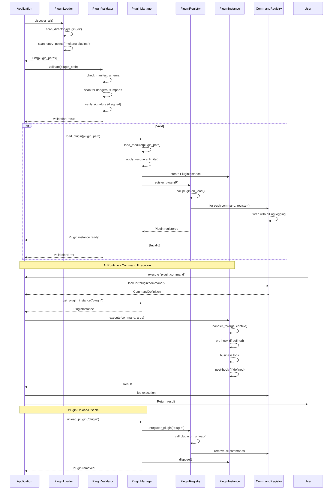

# Plugin Architecture

## Overview

The plugin system enables third-party extensibility while maintaining security, stability, and performance. Plugins can:
- Register new commands under their namespace
- Override core commands (with permission)
- Provide custom integrations (API clients, databases)
- Hook into lifecycle events

## Plugin Manifest Format

```json
{
  "$schema": "https://mekong.dev/schema/plugin-manifest/v1.json",
  "id": "com.example.invoicing",
  "name": "Advanced Invoicing",
  "version": "1.2.3",
  "description": "Multi-currency invoicing with tax compliance",
  "author": {
    "name": "Example Corp",
    "email": "dev@example.com"
  },
  "license": "MIT",
  "homepage": "https://example.com/mekong-plugin",
  "repository": {
    "type": "git",
    "url": "https://github.com/example/mekong-invoicing"
  },
  "plugin": {
    "entrypoint": "dist/index.js",
    "commands": [
      {
        "name": "invoice:create-multi",
        "description": "Create multi-currency invoice with tax calc",
        "schema": {
          "type": "object",
          "properties": {
            "client_id": { "type": "string" },
            "items": { "type": "array", "items": { "type": "object" } },
            "currency": { "type": "string", "enum": ["USD", "EUR", "VND"] }
          },
          "required": ["client_id", "items"]
        },
        "credit_cost": 2
      }
    ],
    "hooks": {
      "on_load": "onPluginLoad",
      "on_unload": "onPluginUnload",
      "on_command_pre": "onCommandPre",
      "on_command_post": "onCommandPost"
    }
  },
  "dependencies": [
    { "id": "mekong.core.finance", "version": ">=1.0.0" }
  ],
  "capabilities": ["network:api:https://api.example.com"],
  "resources": {
    "memory": 256,
    "cpuTime": 30000
  },
  "loadingMode": "worker",
  "hotReload": true
}
```

**Schema Reference:** `contracts/plugin-manifest-schema.json`

## Plugin Discovery

```python
# src/plugins/discovery.py
class PluginDiscovery:
    """Discover available plugins from multiple sources"""

    async def discover_all(self) -> List[Path]:
        """Discover plugins from all configured sources"""
        plugins = []

        # 1. Directory scan
        plugins.extend(self.scan_directory(settings.plugin_dir))

        # 2. Python entry points
        plugins.extend(self.scan_entry_points("mekong.plugins"))

        # 3. Registry query
        if settings.registry_url:
            plugins.extend(await self.scan_registry())

        return plugins

    def scan_directory(self, plugin_dir: Path) -> List[Path]:
        """Scan plugin directory for valid plugin.json files"""
        plugins = []
        for path in plugin_dir.iterdir():
            manifest_path = path / "plugin.json"
            if manifest_path.exists():
                plugins.append(path)
        return plugins

    def scan_entry_points(self, group: str) -> List[Path]:
        """Scan setuptools entry points"""
        import importlib.metadata
        plugins = []
        for entry_point in importlib.metadata.entry_points(group=group):
            try:
                module = importlib.import_module(entry_point.module)
                if hasattr(module, "manifest"):
                    plugins.append(Path(module.__file__).parent)
            except Exception as e:
                logger.warning(f"Failed to load entry point {entry_point}: {e}")
        return plugins
```

## Plugin Lifecycle

The plugin system follows a clear lifecycle from discovery to execution:



## Plugin Loading

### Isolation Strategies

| Strategy | Overhead | Security | Use Case |
|----------|----------|----------|----------|
| **Namespace** | ~10ms | Medium | Trusted internal plugins |
| **Worker** | ~30ms | High | Semi-trusted 3rd party |
| **Process** | ~50ms | Very High | Untrusted marketplace |
| **Container** | ~150ms | Maximum | Enterprise sandbox |

### Namespace Isolation (Default)

```python
# src/plugins/loader_namespace.py
class NamespacePluginLoader:
    """Load plugin in restricted Python namespace"""

    def load(self, plugin_path: Path) -> PluginModule:
        module_name = f"mekong_plugin_{plugin_id}"

        # Create restricted __builtins__
        restricted_builtins = {
            "print": print,
            "len": len,
            "str": str,
            "int": int,
            "float": float,
            "list": list,
            "dict": dict,
            "tuple": tuple,
            "set": set,
            "range": range,
            "enumerate": enumerate,
            "zip": zip,
            "map": map,
            "filter": filter,
            "sum": sum,
            "min": min,
            "max": max,
            "abs": abs,
            "round": round,
            "any": any,
            "all": all,
            "Exception": Exception,
            "ValueError": ValueError,
            "RuntimeError": RuntimeError,
        }

        spec = importlib.util.spec_from_file_location(
            module_name, plugin_path / "index.py"
        )
        module = importlib.util.module_from_spec(spec)

        # Execute in restricted namespace
        old_builtins = __builtins__
        __builtins__ = restricted_builtins
        try:
            spec.loader.exec_module(module)
        finally:
            __builtins__ = old_builtins

        return PluginModule(module=module, isolation="namespace")
```

### Worker Isolation (Web Workers)

```typescript
// packages/plugin-runtime/src/worker.ts
import { parentPort, workerData } from 'worker_threads';

interface WorkerRequest {
  id: string;
  command: string;
  args: Record<string, any>;
}

interface WorkerResponse {
  id: string;
  success: boolean;
  data?: any;
  error?: string;
}

// Load plugin in worker context
const plugin = await loadPlugin(workerData.pluginPath);

parentPort!.on('message', async (request: WorkerRequest) => {
  try {
    const result = await plugin.execute(request.command, request.args);
    const response: WorkerResponse = {
      id: request.id,
      success: true,
      data: result
    };
    parentPort!.postMessage(response);
  } catch (error) {
    parentPort!.postMessage({
      id: request.id,
      success: false,
      error: error.message
    });
  }
});
```

### Process Isolation

```python
# src/plugins/loader_process.py
import subprocess
import json

class ProcessIsolatedPlugin:
    """Run plugin in separate process via stdio"""

    def __init__(self, plugin_path: Path):
        self.process = subprocess.Popen(
            ["python", "-m", "mekong_plugin_runner", str(plugin_path)],
            stdin=subprocess.PIPE,
            stdout=subprocess.PIPE,
            stderr=subprocess.PIPE,
        )
        self._request_id = 0
        self._pending: Dict[int, asyncio.Future] = {}

    async def execute(self, command: str, args: Dict) -> Dict:
        """Send command to plugin process"""
        request_id = self._request_id
        self._request_id += 1

        request = {"id": request_id, "command": command, "args": args}
        future = asyncio.Future()
        self._pending[request_id] = future

        self.process.stdin.write(json.dumps(request) + "\n")
        self.process.stdin.flush()

        try:
            result = await asyncio.wait_for(future, timeout=30)
            return result
        finally:
            self._pending.pop(request_id, None)
```

## Command Registration

```python
# src/plugins/registrar.py
class PluginCommandRegistrar:
    """Register plugin commands with core registry"""

    def register(self, manifest: PluginManifest, plugin_module: Any):
        """Register all commands from plugin manifest"""
        for cmd_def in manifest.plugin.commands:
            # Wrap handler with billing and logging
            async def handler(
                args: Dict,
                context: ExecutionContext,
                cmd_def=cmd_def,
                plugin_module=plugin_module
            ):
                # Pre-execution billing check
                if not await context.billing.check_and_deduct(
                    context.user_id,
                    cmd_def.credit_cost
                ):
                    raise InsufficientCreditsError()

                # Execute plugin command
                handler_func = getattr(plugin_module, cmd_def.handler)
                result = await handler_func(args, context)

                # Post-execution logging
                await context.logger.log_command(
                    user_id=context.user_id,
                    command=f"{manifest.id}:{cmd_def.name}",
                    args=args,
                    result=result
                )

                return result

            # Register with core registry
            full_name = f"{manifest.id}:{cmd_def.name}"
            CommandRegistry.register(CommandDefinition(
                name=full_name,
                description=cmd_def.description,
                category=cmd_def.category,
                schema=cmd_def.schema,
                credit_cost=cmd_def.credit_cost,
                requires_approval=cmd_def.requires_approval,
                plugin_id=manifest.id,
                handler=handler
            ))

            logger.info(f"Registered plugin command: {full_name}")
```

## Lifecycle Hooks

```python
class PluginLifecycle:
    """Hook points for plugin lifecycle management"""

    HOOKS = ["on_load", "on_unload", "on_command_pre", "on_command_post"]

    async def load_plugin(self, manifest: PluginManifest, module: Any):
        """Load plugin and call on_load hook"""
        if hasattr(module, "on_load"):
            await module.on_load(PluginContext(
                config=manifest.config or {},
                registry=CommandRegistry(),
                logger=getPluginLogger(manifest.id)
            ))

    async def unload_plugin(self, plugin_id: str):
        """Unload plugin and call on_unload hook"""
        plugin = self._plugins.get(plugin_id)
        if plugin and hasattr(plugin.module, "on_unload"):
            await plugin.module.on_unload()
        self._plugins.pop(plugin_id, None)

    async def pre_execute(self, command: str, args: Dict, context: ExecutionContext):
        """Call on_command_pre hooks"""
        plugin_id = command.split(":")[0]
        plugin = self._plugins.get(plugin_id)
        if plugin and hasattr(plugin.module, "on_command_pre"):
            await plugin.module.on_command_pre(command, args, context)

    async def post_execute(self, command: str, result: CommandResult, context: ExecutionContext):
        """Call on_command_post hooks"""
        plugin_id = command.split(":")[0]
        plugin = self._plugins.get(plugin_id)
        if plugin and hasattr(plugin.module, "on_command_post"):
            await plugin.module.on_command_post(command, result, context)
```

## Security Model

### Capability-based Permissions

```json
{
  "capabilities": [
    "network:api:https://api.example.com",
    "filesystem:read:/data/",
    "database:query:SELECT:users,orders",
    "env:read:API_KEY,DB_URL"
  ]
}
```

### Capability Enforcement

```python
# src/plugins/security.py
class CapabilityEnforcer:
    """Enforce plugin capability permissions"""

    CAPABILITY_PATTERNS = {
        "network": re.compile(r"^network:(api|tcp|udp):(.+)$"),
        "filesystem": re.compile(r"^filesystem:(read|write):(.+)$"),
        "database": re.compile(r"^database:(query|schema):(.+)$"),
        "env": re.compile(r"^env:(read|write):(.+)$"),
        "command": re.compile(r"^command:(execute|list):(.+)$"),
    }

    def check(self, plugin_id: str, capability: str, resource: str):
        """Verify plugin has required capability"""
        plugin_caps = self.get_plugin_capabilities(plugin_id)

        for cap in plugin_caps:
            if self._matches(cap, capability, resource):
                return True

        raise PermissionError(
            f"Plugin {plugin_id} lacks {capability}:{resource}"
        )

    def _matches(self, capability: str, required: str, resource: str) -> bool:
        parts = capability.split(":", 2)
        if len(parts) != 3:
            return False

        cap_type, cap_action, cap_resource = parts
        req_parts = required.split(":", 1)

        if cap_type != req_parts[0]:
            return False

        # Check resource matches with wildcard support
        if cap_resource == "*":
            return True
        if fnmatch.fnmatch(resource, cap_resource):
            return True
        if resource.startswith(cap_resource):
            return True

        return False
```

### Resource Limits

```yaml
# In plugin manifest
resources:
  memory: 256        # MB
  cpuTime: 30000     # ms
  storage: 100       # MB
  network: 1048576   # bytes/day (1MB)
```

```python
# src/plugins/sandbox.py
import resource

def apply_resource_limits(limits: PluginResourceLimits):
    """Apply OS-level resource limits to current process"""
    # Memory limit
    if limits.memory:
        mem_bytes = limits.memory * 1024 * 1024
        resource.setrlimit(resource.RLIMIT_AS, (mem_bytes, mem_bytes))

    # CPU time limit
    if limits.cpuTime:
        cpu_seconds = limits.cpuTime / 1000
        resource.setrlimit(resource.RLIMIT_CPU, (cpu_seconds, cpu_seconds + 10))

    # File descriptors
    resource.setrlimit(resource.RLIMIT_NOFILE, (1024, 1024))

    # Core dump size (disable)
    resource.setrlimit(resource.RLIMIT_CORE, (0, 0))
```

## Dependency Resolution

```python
# src/plugins/resolver.py
class DependencyResolver:
    """Resolve plugin dependencies with version constraints"""

    async def resolve(self, plugin_id: str) -> List[PluginManifest]:
        """Topologically sort dependencies"""
        manifest = await self.fetch_manifest(plugin_id)
        resolved = []
        visited = set()

        async def visit(plugin_id: str):
            if plugin_id in visited:
                return
            visited.add(plugin_id)

            m = await self.fetch_manifest(plugin_id)
            for dep in m.dependencies:
                await visit(dep.id)
                resolved.append(dep)

        await visit(plugin_id)
        return self.topological_sort(resolved)

    def topological_sort(self, manifests: List[PluginManifest]) -> List[PluginManifest]:
        """Sort by dependency order (deps first)"""
        graph = {m.id: [d.id for d in m.dependencies] for m in manifests}
        sorted_ids = []
        visited = set()

        def dfs(node: str):
            if node in visited:
                return
            visited.add(node)
            for dep in graph.get(node, []):
                dfs(dep)
            sorted_ids.append(node)

        for node in graph:
            dfs(node)

        id_to_manifest = {m.id: m for m in manifests}
        return [id_to_manifest[id] for id in sorted_ids if id in id_to_manifest]
```

## Plugin Health Monitoring

```python
# src/plugins/health.py
class PluginHealthMonitor:
    """Track and report plugin health metrics"""

    async def record_execution(
        self,
        plugin_id: str,
        success: bool,
        duration_ms: int
    ):
        """Record execution for health calculation"""
        await redis.incr(f"plugin:{plugin_id}:executions:total")
        if success:
            await redis.incr(f"plugin:{plugin_id}:executions:success")
        await redis.lpush(
            f"plugin:{plugin_id}:durations",
            duration_ms
        )
        await redis.ltrim(f"plugin:{plugin_id}:durations", 0, 999)

    async def get_health(self, plugin_id: str) -> PluginHealth:
        """Calculate current health status"""
        total = await redis.get(f"plugin:{plugin_id}:executions:total") or 0
        success = await redis.get(f"plugin:{plugin_id}:executions:success") or 0

        error_rate = 1 - (success / total) if total > 10 else 0
        durations = await redis.lrange(f"plugin:{plugin_id}:durations", 0, 99)
        avg_duration = sum(int(d) for d in durations) / len(durations) if durations else 0

        status = "healthy"
        if error_rate > 0.5 or avg_duration > 10000:
            status = "unhealthy"
        elif error_rate > 0.2 or avg_duration > 5000:
            status = "degraded"

        return PluginHealth(
            status=status,
            total_executions=total,
            success_rate=success / total if total > 0 else 1.0,
            average_duration_ms=avg_duration
        )
```

## Plugin SDK (Developer API)

```typescript
// packages/plugin-sdk/src/index.ts
export interface MekongPlugin {
  name: string;
  version: string;
  commands: CommandDefinition[];
  hooks?: HookDefinitions;
}

export interface CommandDefinition {
  name: string;
  description: string;
  schema: ZodSchema;
  execute: (args: any, context: PluginContext) => Promise<any>;
}

export interface PluginContext {
  userId: string;
  logger: PluginLogger;
  config: Record<string, any>;
  billing: {
    checkBalance: (credits: number) => Promise<boolean>;
  };
}

// Example plugin
const plugin: MekongPlugin = {
  name: "com.example.invoicing",
  version: "1.0.0",
  commands: [
    {
      name: "create",
      description: "Create an invoice",
      schema: z.object({
        customerId: z.string(),
        items: z.array(z.object({
          description: z.string(),
          quantity: z.number(),
          unitPrice: z.number()
        }))
      }),
      execute: async (args, context) => {
        // Plugin implementation
        return { invoiceId: "inv_123", total: 1500 };
      }
    }
  ]
};

export default plugin;
```

## Related Documents

| Document | Purpose |
|----------|---------|
| [System Architecture](system-architecture.md) | Overall layered architecture and component overview |
| [Command Execution Flow](command-execution-flow.md) | How commands are routed and executed at runtime |
| [Data Models](data-models.md) | Database schema for plugins, plugin_installs, health |
| [ADR Index](adr-index.md) | Architecture decisions (future: plugin system ADRs) |

## Next Steps

1. Implement all isolation strategies with proper error handling
2. Build plugin registry service for discoverability
3. Create plugin validator (manifest + security scan)
4. Design plugin marketplace UI/UX
5. Add plugin auto-update mechanism
