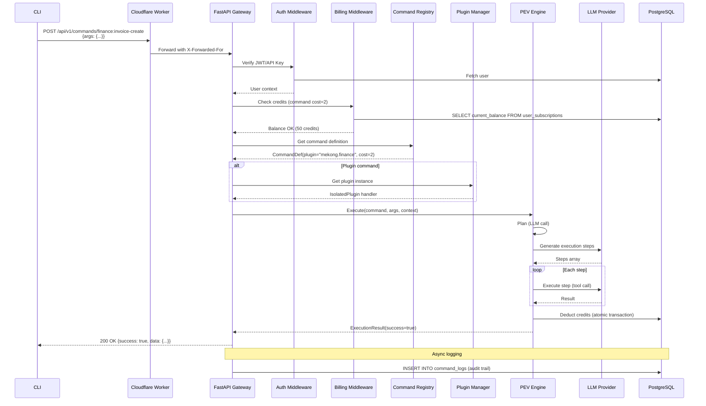

# System Architecture - SME Agentic Platform

## Overview

The SME Agentic Platform is a **hybrid modular monolith** designed for one-person businesses and SMBs. It combines a TypeScript CLI for user interaction with a Python FastAPI backend for heavy AI-powered automation, orchestrated through a Plan-Execute-Verify (PEV) engine.

**Key Characteristics:**
- Single deployable unit with clear module boundaries
- Plugin system for third-party extensibility
- Credit-based billing with real-time deduction
- Cloudflare Workers edge deployment capability

```
┌─────────────────────────────────────────────────────────────┐
│                     TypeScript CLI                          │
│  ┌─────────────┐ ┌─────────────┐ ┌─────────────────────┐  │
│  │  Command A  │ │  Command B  │ │  Plugin Commands    │  │
│  └─────────────┘ └─────────────┘ └─────────────────────┘  │
└───────────────────────────┬─────────────────────────────────┘
                            │ HTTPS (JWT auth)
┌───────────────────────────▼─────────────────────────────────┐
│                  FastAPI Gateway                           │
│  ┌─────────────┐ ┌─────────────┐ ┌─────────────────────┐  │
│  │   Auth      │ │  Rate       │ │   Billing Middle    │  │
│  │   (JWT)     │ │  Limit      │ │   (check credits)   │  │
│  └─────────────┘ └─────────────┘ └─────────────────────┘  │
└───────────────────────────┬─────────────────────────────────┘
                            │
┌───────────────────────────▼─────────────────────────────────┐
│                Command Router                              │
│  ┌─────────────────────────────────────────────────────┐  │
│  │  Command Registry (name → handler)                  │  │
│  │  - Core commands (built-in)                         │  │
│  │  - Plugin commands (dynamic)                        │  │
│  └─────────────────────────────────────────────────────┘  │
└───────────────────────────┬─────────────────────────────────┘
                            │
            ┌───────────────┴───────────────┐
            │                               │
    ┌───────▼──────┐              ┌────────▼─────────┐
    │  PEV Engine  │              │   Billing Svc    │
    │  - Planner   │              │   - Credit deduct│
    │  - Executor  │              │   - Balance check│
    │  - Verifier  │              │   - Webhook sync │
    └───────┬──────┘              └────────┬─────────┘
            │                               │
            └───────────────┬───────────────┘
                            │
┌───────────────────────────▼─────────────────────────────────┐
│                   PostgreSQL + Redis                       │
│  ┌─────────────┐ ┌─────────────┐ ┌─────────────────────┐  │
│  │  Users      │ │  Commands   │ │  Credits            │  │
│  │  Sessions   │ │  Logs       │ │  Transactions       │  │
│  │  API Keys   │ │  Audit      │ │  Plans              │  │
│  └─────────────┘ └─────────────┘ └─────────────────────┘  │
└─────────────────────────────────────────────────────────────┘
```

## Module Breakdown

| Module | Responsibility | Language | Size Target | Dependencies |
|--------|----------------|----------|-------------|--------------|
| `core/` | PEV engine, auth, config | Python | ~3000 LOC | FastAPI, Redis |
| `commands/` | Command definitions, registry | Python | ~8000 LOC | core, models |
| `billing/` | Credit tracking, payment integration | Python | ~2000 LOC | core, models |
| `plugins/` | Plugin discovery, loading, lifecycle | Python | ~1500 LOC | core, commands |
| `api/` | FastAPI routes, middleware | Python | ~2000 LOC | core, all above |
| `models/` | SQLAlchemy Core models, migrations | Python | ~1000 LOC | PostgreSQL |
| `cli/` | TypeScript CLI, command implementations | TS | ~10000 LOC | Node.js |

## Technology Stack

### Backend
- **Language**: Python 3.11+
- **Framework**: FastAPI 0.100+ (async, OpenAPI native)
- **ORM**: SQLAlchemy Core (no ORM for performance)
- **Database**: PostgreSQL 14+ (primary), Redis 7+ (cache/sessions)
- **LLM Integration**: Any OpenAI-compatible API (Claude, Qwen, Ollama)

### CLI
- **Language**: TypeScript 5+
- **Framework**: Commander.js (simple, battle-tested)
- **Validation**: Zod (runtime schema validation)
- **Distribution**: npm package `@mekongcli/cli-core`

### Infrastructure
- **Local**: Docker Compose (PostgreSQL, Redis, FastAPI)
- **Edge**: Cloudflare Workers (FastAPI → Worker adapter)
- **CI/CD**: GitHub Actions
- **Observability**: OpenTelemetry, Sentry

## Data Flow: Command Execution



## Performance Targets

| Metric | Target | Measurement |
|--------|--------|-------------|
| API p95 latency | <500ms | Excluding LLM calls |
| Concurrent users | 1,000 | Active sessions |
| Command throughput | 100 req/s | Sustained |
| Plugin load time | <100ms | Cold load |
| Database query p99 | <50ms | Indexed queries |
| Cache hit rate | >80% | Command definitions |

## Scalability Patterns

### Horizontal Scaling
- Gateway stateless → multiple instances behind load balancer
- Redis shared cache → consistent rate limiting across instances
- Database connection pool → pgBouncer with transaction pooling
- Read replicas → command_logs queries offloaded

### Vertical Scaling
- Increase worker memory for larger plugin isolation
- Use larger Redis instances for bigger session caches
- Upgrade database with more CPU for complex PEV planning

## Caching Strategy

| Layer | Technology | What | TTL |
|-------|------------|------|-----|
| L1 | In-memory LRU | Command definitions, user info | 5m |
| L2 | Redis | Sessions, rate limits, plugin manifests | 1h |
| L3 | Cloudflare KV | Plugin assets, static configs | 24h |

## Security Model

### Authentication
- JWT tokens for CLI/IDE sessions (15-minute expiry)
- API keys for programmatic access (sha256 hash stored)
- Refresh token rotation for long-lived sessions

### Authorization
- Permission-based: `command:execute`, `plugin:install`, `billing:read`
- Scoped API keys with command whitelist
- Role hierarchy: admin → member → viewer

### Rate Limiting
- Per API key: 1000 req/min (burst 100)
- Per IP: 100 req/min (burst 50)
- Distributed via Redis with sliding window

### Audit Logging
- All command executions logged with user, args, result, duration
- Immutable audit trail in `audit_logs` table
- Structured logs exported to OpenTelemetry

## Deployment Architecture

### Local Development
```yaml
# docker-compose.yml
services:
  postgres:
    image: postgres:15
    volumes: [pg-data:/var/lib/postgresql/data]

  redis:
    image: redis:7-alpine

  api:
    build: .
    command: uvicorn src.api.main:app --reload
    env_file: .env
    depends_on: [postgres, redis]
    ports: ["8000:8000"]
```

### Edge Deployment (Cloudflare Workers)
- Workers KV for plugin cache
- D1 for read-heavy command logs
- Hyperdrive for PostgreSQL connection pooling
- Separate Workers API or rewrite rules for FastAPI compatibility

## Configuration Management

```yaml
# config.yaml - production
api:
  host: "0.0.0.0"
  port: 8000
  cors_origins: ["https://ide.mekongmind.com"]

database:
  url: ${POSTGRES_URL}
  pool_size: 20
  max_overflow: 10
  echo: false

redis:
  url: ${REDIS_URL}
  pool_size: 20

billing:
  default_credit_cost: 1
  minimum_balance: 0
  low_balance_threshold: 10

plugins:
  isolation: "namespace"  # namespace, process, container
  plugin_dir: "/app/plugins"
  auto_reload: false

llm:
  default_provider: "anthropic"
  providers:
    anthropic:
      base_url: "https://api.anthropic.com/v1"
      models: ["claude-opus-4-6", "claude-sonnet-4-6"]
    ollama:
      base_url: "http://localhost:11434/v1"
      models: ["qwen2.5-coder"]

observability:
  otlp_endpoint: ${OTLP_ENDPOINT}
  sentry_dsn: ${SENTRY_DSN}
  log_level: "INFO"
```

## Error Handling Strategy

| Error Type | HTTP Status | Retry Behavior |
|------------|-------------|----------------|
| Validation error | 400 | No retry |
| Authentication failed | 401 | No retry (re-auth) |
| Insufficient credits | 402 | No retry (billing UI) |
| Command not found | 404 | No retry |
| Rate limit exceeded | 429 | Exponential backoff |
| LLM provider error | 502 | Retry 2x with fallback |
| Internal error | 500 | Retry 1x, then support ticket |

## Next Steps

1. **Phase 3**: Billing system detailed design
2. **Phase 4**: Command framework implementation
3. **Phase 5**: Plugin system with isolation
4. **Phase 6**: FastAPI backend integration

---

## Related Documents

| Document | Purpose |
|----------|---------|
| [Command Execution Flow](command-execution-flow.md) | Detailed runtime pipeline and error handling |
| [Plugin Architecture](plugin-architecture.md) | Plugin system design (to be implemented in Phase 5) |
| [Data Models](data-models.md) | Database schema for users, commands, billing |
| [API Specification](api-spec.yaml) | OpenAPI spec for REST endpoints |
| [ADR Index](adr-index.md) | Architecture decision records |

## Document Version

- **Version**: 1.0
- **Last Updated**: 2026-06-20
- **Status**: Draft — Phase 2 design in progress
- **Audience**: Architecture team, engineering leads

