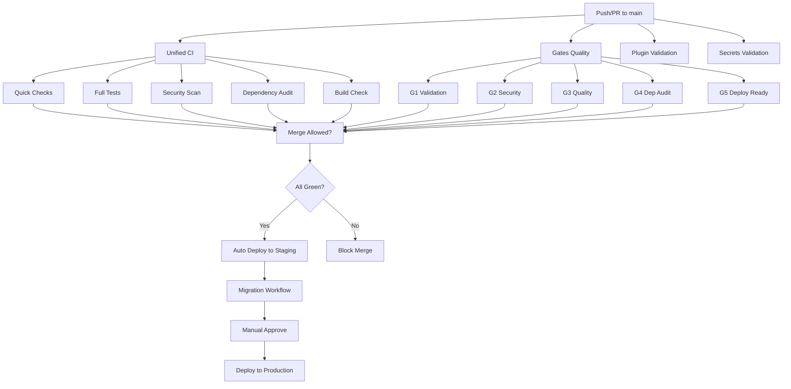

# CI/CD Pipeline Documentation

This document describes the continuous integration and deployment pipelines for the Mekong CLI project.

## Overview

The project uses GitHub Actions for CI/CD with multiple specialized workflows:



## CI/CD Workflows

### 1. Unified CI (`unified-ci.yml`)

The main CI workflow that runs on every push and PR. Provides a comprehensive status check.

**Triggers:**
- Push to `main` or `develop`
- PR targeting `main`

**Jobs:**
- `quick-checks` - Fast linting and type checking (fails fast)
- `full-tests` - Complete test suite on Python 3.11 and 3.12
- `security-scan` - Bandit and Semgrep security scans
- `dependency-audit` - pip-audit and OSV scanner for vulnerabilities
- `build-check` - Package build verification

**Status Badge:**
```markdown
[](https://github.com/longtho638-jpg/mekong-cli/actions/workflows/unified-ci.yml)
```

### 2. Quality Gates (`gates.yml`)

The 5-gate quality system with strict thresholds:

| Gate | Purpose | Threshold |
|------|---------|-----------|
| G1 Validation | Lint + unit tests | Pass required |
| G2 Security | Security scans | No CRITICAL/HIGH |
| G3 Quality | Coverage check | >= 40% |
| G4 Dep Audit | Dependency scan | No HIGH vulns |
| G5 Deploy Ready | Cloudflare config | Config present |

**Merge Protection:** Branch protection rules require all 5 gates to pass before merging.

### 3. Integration Tests (`integration-tests.yml`)

Runs integration and E2E tests against a test database.

**Triggers:**
- Push to `main` or `develop`
- PR targeting `main`
- Manual dispatch with environment selection

**Jobs:**
- `integration-tests` - Tests in `tests/integration/` and `tests/e2e/`
- `gateway-integration` - Gateway API tests (`test_gateway_endpoints.py`, `test_api_endpoints.py`)
- `contract-validation` - Factory contracts generation and validation

**Coverage Target:** 20% (integration tests supplement unit tests)

### 4. Plugin Validation (`plugin-validation.yml`)

Specialized CI for plugin development. Runs when plugin manifests change.

**Triggers:**
- Changes to `packages/**/mekong-plugin.json`
- Changes to `packages/**/src/**` or `packages/**/tests/**`

**Jobs:**
- `plugin-manifest-validation` - Validate plugin.json against schema
- `plugin-lint` - Ruff linting for plugin code
- `plugin-typecheck` - Mypy type checking
- `plugin-tests` - Plugin unit tests
- `plugin-security` - Bandit security scan
- `plugin-deps` - Dependency specification validation
- `plugin-load-test` - Plugin loading stress test

### 5. Secrets Validation (`secrets-validation.yml`)

Validates secret handling and configuration security.

**Jobs:**
- `validate-secrets` - Scan for hardcoded secrets, document required GitHub secrets
- `validate-config` - Validate Cloudflare and Docker configurations

**Purpose:** Prevents accidental secret leaks and ensures deployment configuration is complete.

### 6. Deploy Cloudflare (`deploy-cf.yml`)

Deploys Cloudflare Workers and Pages applications.

**Triggers:**
- Push to `main`/`develop` with changes to `apps/dashboard/` or `apps/api/`

**Deployment Targets:**
- **Dashboard** (`apps/dashboard/`) → Cloudflare Pages
- **API Worker** (`apps/api/`) → Cloudflare Workers
- **Mekong Engine** (`packages/mekong-engine/`) → Cloudflare Workers
- **Zalo Parser** (`packages/zalo-parser/`) → Cloudflare Workers

**Environment Separation:**
- `staging` environment for preview deployments
- `production` environment for main branch

**Verification:** Type check and lint before deployment.

### 7. Database Migrations (`migrations.yml`)

Manages database schema migrations with safety guards.

**Triggers:**
- Manual dispatch
- Repository dispatch from deploy workflow
- Daily schedule (2 AM UTC)

**Features:**
- Automatic backup before migration
- Pre-flight health checks
- Post-migration verification
- Slack/PagerDuty alerts on failure
- Staging auto-migrates, production requires manual dispatch

### 8. Load Testing (`load-testing.yml`)

Performance and load testing suite.

**Triggers:**
- Push to `main`/`develop`
- Nightly schedule (2 AM UTC)
- Manual dispatch with VUS/duration parameters

**Tools:**
- **k6** - API load testing
- **Lighthouse CI** - Frontend performance

**Threshold Enforcement:** Performance regressions cause workflow failure.

### 9. Security Hardening (`security-hardening.yml`)

Comprehensive security audit workflow (runs weekly or on manual trigger).

**Scans:**
- Trivy filesystem vulnerability scan
- OWASP ZAP baseline scan (on staging)
- Dependency vulnerability scanning
- Secret detection scanning

### 10. Deployment Workflows

| Workflow | Target | Trigger |
|----------|--------|---------|
| `deploy.yml` | Kubernetes (nhipdieuxanh) | Push to main |
| `deploy-dashboard.yml` | Dashboard preview URLs | PR to main |
| `deploy-landing.yml` | Landing page | Push to main |
| `deploy-site.yml` | Static sites | Push to main |

## Branch Protection

Configure branch protection on `main` branch with:

### Required Status Checks
- `unified-ci` (all jobs)
- `gates` (all 5 gates)
- `integration-tests` (all jobs)
- `plugin-validation.yml` (if plugin changes)
- `secrets-validation` (recommended)

### Protection Rules
- ✅ Require pull request reviews (1+ approver)
- ✅ Require status checks to pass
- ✅ Restrict pushes (maintainers only)
- ✅ Require linear history
- ✅ Require conversation resolution

## Required Secrets

Set these in **Settings → Secrets and variables → Actions**:

| Secret | Purpose | Required For |
|--------|---------|--------------|
| `JWT_SECRET` | Token signing | Tests, migrations |
| `CF_API_TOKEN` | Cloudflare auth | Deploy workflows |
| `CF_ACCOUNT_ID` | Cloudflare account | Deploy workflows |
| `STAGING_DATABASE_URL` | Staging DB | Migrations, integration tests |
| `PRODUCTION_DATABASE_URL` | Production DB | Migrations |
| `SLACK_WEBHOOK_URL` | Notifications | Migrations, deployment alerts |
| `PAGERDUTY_INTEGRATION_KEY` | Incident alerts | Production migrations |
| `BACKUP_S3_BUCKET` | Backup storage | Database backups |
| `API_TEST_KEY` | Load testing auth | Load tests |

## Local Testing

Before pushing, run the equivalent checks locally:

```bash
# Quick checks (what CI runs first)
make lint-full        # Python + Node linting
make type-check       # TypeScript checks

# Full test suite
make test-full        # Python + Node tests

# Security scan
make security-review  # Or: bandit -r src/

# Build verification
make build           # Build all packages

# Integration tests (requires database)
pytest tests/integration/ tests/e2e/

# Contract validation
make regenerate      # generate + validate + self-test
```

## CI/CD Best Practices

1. **Fast Feedback:** Quick checks run first to fail fast
2. **Matrix Testing:** Python 3.11 and 3.12 tested in parallel
3. **Artifacts:** Test results and coverage uploaded for debugging
4. **No Secrets in Code:** All secrets use GitHub Secrets or environment variables
5. **Rollback Ready:** Database backups before migrations
6. **Manual Gates:** Production deployments require manual approval
7. **Notifications:** Slack/PagerDuty alerts for failures

## Troubleshooting

### CI Flakiness
If tests are flaky, add `--count=5 --reruns=3` to pytest command in the workflow.

### Stuck Deployments
Check Cloudflare dashboard for Workers status. Clear Wrangler cache if needed.

### Migration Failures
1. Check database connectivity
2. Verify backup was created (check S3)
3. Rollback using the same workflow with rollback input

### Secrets Not Found
Ensure secrets are set at repository level (not environment) for universal access.

## Monitoring

- **Workflow Runs:** GitHub Actions tab
- **Deployment Status:** Cloudflare Dashboard → Workers & Pages
- **Database Health:** Run `python3 -m src.db.migrate status`
- **API Health:** `GET /healthz` endpoint

## Related Documentation

- [Deployment Guide](./deployment-guide.md)
- [Security Policy](../SECURITY.md)
- [Contributing Guide](../CONTRIBUTING.md)
- [Factory Contracts](../factory/README.md)
