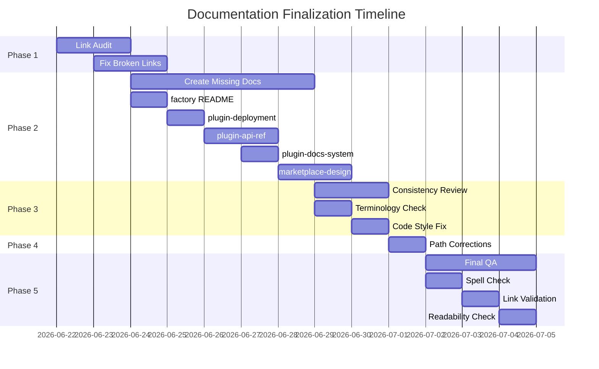

# Documentation Finalization Plan

**Last Updated**: 2026-06-22  
**Status**: Action Plan  
**Based on**: Documentation audit (Task #251)  
**Owner**: Documentation Manager  

---

## 1. Executive Summary

The documentation audit revealed 57 markdown files with several gaps and inconsistencies. This plan prioritizes fixes to ensure all user-facing documentation is accurate, complete, and consistent before GA release (2026-06-30).

**Key priorities**:
1. Fix broken internal links (high user impact)
2. Create missing critical documents referenced elsewhere
3. Verify completeness of all user-facing docs
4. Ensure consistency in terminology and examples
5. Final polish and quality assurance

---

## 2. Current State Assessment

### 2.1 What's Working Well

- ✅ 57 markdown files in `docs/` with good coverage
- ✅ Comprehensive plugin documentation suite
- ✅ Architecture decision records (ADRs) complete
- ✅ API documentation standardized
- ✅ Security and compliance docs complete

### 2.2 Gaps Identified

From audit report (Task #251):

| Gap | Severity | Impact |
|-----|----------|--------|
| Broken internal links (5+ instances) | High | User confusion, dead ends |
| Missing referenced documents (6 files) | High | Incomplete guidance |
| Incorrect path references (user-onboarding-flow.md) | Medium | Broken navigation |
| Terminology inconsistencies | Low | Professional polish |
| Outdated cross-references | Low | Stale information |

### 2.3 Missing Documents (Must Create)

Referenced but non-existent:

1. `docs/factory/README.md` - Factory module documentation
2. `docs/plugin-deployment.md` - Plugin deployment procedures
3. `docs/plugin-api-reference.md` - Complete plugin API reference
4. `docs/plugin-docs-system/` - Plugin documentation system index
5. `docs/GTM-Strategy.md` - Go-to-market strategy
6. `docs/marketplace-design/` - Marketplace UI/UX specifications

---

## 3. Phase Breakdown

### Phase 1: Link Integrity (Days 1-2) — CRITICAL

**Objective**: Fix all broken internal links

**Tasks**:

1. **Audit broken links**
   - Run link checker across all docs
   - Document all broken references
   - Categorize: missing target vs. incorrect path

2. **Fix incorrect paths**
   - Update paths that point to moved/renamed files
   - Use relative paths consistently
   - Verify all `[text](./path.md)` point to existing files

3. **Create missing link targets OR remove references**
   Decision matrix:

   | Referenced Document | Action |
   |---------------------|--------|
   | `factory/README.md` | Create (factory module exists) |
   | `plugin-deployment.md` | Create (needed for plugin devs) |
   | `plugin-api-reference.md` | Create (auto-gen from code) |
   | `plugin-docs-system/` | Create index + structure |
   | `GTM-Strategy.md` | Already exists as `gtm-strategy.md` → fix path |
   | `marketplace-design/` | Create wireframes + specs |

4. **Validate**
   ```bash
   npx markdown-link-check docs/**/*.md
   # Expect: 0 broken links
   ```

**Success criteria**:
- All internal links resolve
- No 404s in documentation
- Navigation works end-to-end

---

### Phase 2: Missing Critical Documentation (Days 3-5) — HIGH

**Objective**: Create essential missing documents

#### Task 2.1: factory/README.md

**Why**: Factory module contains plugin development contracts; referenced in developer guides.

**Content**:
- Factory module purpose and architecture
- Contract JSON schema format
- How to add new contracts
- Example contract with all fields
- Validation and testing procedures

**Owner**: Plugin SDK team  
**Review**: Docs manager

#### Task 2.2: plugin-deployment.md

**Why**: Plugin developers need deployment best practices.

**Content**:
- Deployment options (Cloudflare Workers, standalone)
- Environment configuration
- Security hardening for production
- Monitoring and observability setup
- Rollback procedures
- Performance tuning

**Owner**: Infrastructure team  
**Review**: Docs manager + Security

#### Task 2.3: plugin-api-reference.md

**Why**: Comprehensive API reference for plugin developers.

**Approach**: Auto-generate from source code docstrings using Sphinx or mkdocs.

**Structure**:
- `mekong.plugin.Plugin` base class
- `mekong.plugin.PluginManager`
- `mekong.plugin.PluginRegistry`
- `mekong.plugin.PluginValidator`
- Manifest schema (JSON Schema)
- Permissions enums and classes

**Generation command**:
```bash
python scripts/generate-plugin-api-docs.py --output docs/plugin-api-reference.md
```

**Owner**: Documentation automation  
**Review**: SDK leads

#### Task 2.4: plugin-docs-system/index.md

**Why**: Central navigation hub for all plugin documentation.

**Content**:
- Overview of plugin documentation system
- Quick links to all plugin docs
- Getting started path for new developers
- Contribution guidelines for docs
- Templates and standards

**Owner**: Docs manager

#### Task 2.5: marketplace-design/ directory

**Why**: Marketplace wireframes and design specs referenced in product docs.

**Files to create**:
- `marketplace-design/README.md` - Design system overview
- `marketplace-design/wireframes.md` - Figma wireframes (embedded)
- `marketplace-design/components.md` - UI component specs
- `marketplace-design/user-flows.md` - User journey diagrams

**Owner**: UX team  
**Review**: Product + Engineering

---

### Phase 3: Consistency Review (Days 6-7) — MEDIUM

**Objective**: Ensure terminology, style, and patterns consistent across all docs

**Checklist**:

1. **Terminology consistency**
   - Use "plugin" not "module" or "extension" (unless legacy)
   - Use "command" for CLI actions
   - Use "manifest" for plugin configuration file
   - Consistent capitalization: "Mekong CLI" vs "mekong-cli"

2. **Code style**
   - All Python examples use 4-space indentation
   - All shell examples use bash
   - All JSON examples properly formatted
   - Variable names use consistent casing

3. **Command examples**
   - All commands show actual output (not "Output goes here")
   - Use consistent `$` prompt prefix for shell
   - Show error messages where relevant

4. **Links and cross-references**
   - All `docs/` links use relative paths
   - All `https://` links include `http://` or `https://`
   - All internal references include anchors where needed

5. **Metadata**
   - All files have `lastUpdated` date
   - All files have `status` field (Draft/Review/Stable)
   - Audience field set appropriately

**Process**:
- Review each document in `docs/` systematically
- Use grep to find inconsistent terms:
  ```bash
  grep -r "module\|extension" docs/ --include="*.md"
  grep -r "Mekong CLI\|mekong-cli" docs/ --include="*.md"
  ```
- Fix inconsistencies in place

---

### Phase 4: Path Corrections (Day 8) — MEDIUM

**Specific fix needed**: `docs/user-onboarding-flow.md` has incorrect path references

**Actions**:
1. Read the file and identify incorrect paths
2. Update to match actual file locations
3. Verify all referenced files exist at specified paths
4. Test navigation flow end-to-end

---

### Phase 5: Final QA & Polish (Days 9-10) — LOW

**Objective**: Final quality assurance before GA

**Tasks**:

1. **Spell check all documents**
   ```bash
   find docs/ -name "*.md" -exec codespell {} \;
   ```

2. **Link validation** (repeat from Phase 1)
   ```bash
   npx markdown-link-check docs/**/*.md
   ```

3. **Readability check** ( Hemingway or similar)
   - Target: Grade 8-10 reading level for user-facing docs
   - Technical docs can be higher (Grade 12-14)

4. **Table formatting**
   - All tables have headers
   - Column widths reasonable
   - No excessive nested tables

5. **Code block syntax highlighting**
   - All code blocks have language identifier
   - Example: ```python, ```bash, ```json

6. **Image alt text**
   - All images have descriptive alt text
   - Complex diagrams include long descriptions

7. **PDF export test**
   - Convert to PDF to verify print layout
   - Check page breaks, table continuity

---

## 4. Timeline & Dependencies



**Critical path**: Phase 2 (missing docs) → Phase 3 (consistency) → Phase 5 (final QA)

**Dependencies**:
- Phase 2.3 (plugin-api-ref) depends on SDK API stability
- Phase 2.5 (marketplace-design) depends on UX finalizing wireframes

---

## 5. Success Criteria

| Metric | Target | Measurement |
|--------|--------|-------------|
| Broken links | 0 | `markdown-link-check` |
| Missing critical docs | 0 created | File existence check |
| Terminology consistency | 100% | Manual review |
| Documentation coverage | 100% user flows | Checklist review |
| Docs reviewed by SME | 100% | Review sign-off |
| GA release readiness | ✅ | Docs complete pre-GA |

---

## 6. Risk Register

| Risk | Probability | Impact | Mitigation |
|------|-------------|--------|------------|
| Missing API stability for auto-generated docs | Medium | High | Freeze API before generation; document stable interfaces only |
| Marketplace wireframes not ready in time | Low | Medium | Use placeholder; add note "design in progress" |
| Link checker false positives on local paths | Low | Low | Manually verify all flagged links |
| Terminology review takes longer than planned | Medium | Medium | Prioritize high-traffic docs first |
| Security review blocks security-hardening doc | Low | Medium | Involve security team early in drafting |

---

## 7. Deliverables

### Completed Documents

- [ ] `docs/factory/README.md`
- [ ] `docs/plugin-deployment.md`
- [ ] `docs/plugin-api-reference.md`
- [ ] `docs/plugin-docs-system/index.md`
- [ ] `docs/marketplace-design/` (full directory)
- [ ] Updated `docs/user-onboarding-flow.md` (fixed paths)
- [ ] Consistency-corrected all `docs/*.md`

### Process Artifacts

- [ ] Link audit report (Phase 1.1)
- [ ] Terminology standards document (Phase 3)
- [ ] QA checklist sign-off (Phase 5)

---

## 8. Post-Plan: Ongoing Maintenance

After finalization, establish:

1. **Docs-as-code workflow**
   - Documentation changes require PR review
   - Link checker runs on every PR
   - Docs updated with every code change

2. **Documentation owner per module**
   - Plugin SDK: Plugin docs owner
   - Infrastructure: Deployment docs owner
   - Security: Security hardening guide owner

3. **Regular audits**
   - Monthly link health check
   - Quarterly completeness review
   - Annual information architecture review

---

**Next Steps**:

1. Get plan approval from Engineering Manager
2. Assign Phase 1 (Link Audit) to Technical Writer
3. Begin execution immediately (target GA: 2026-06-30)
