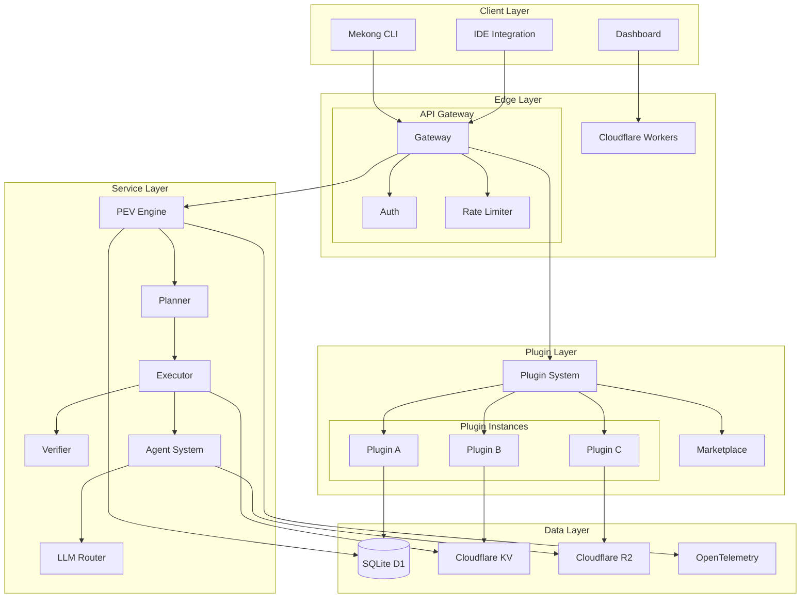

# Greenfield Platform Architecture Summary

**Document**: SME Agentic Platform Architecture  
**Last Updated**: 2026-06-22  
**Status**: Stable — Architecture Complete  
**Audience**: Engineers, Architects, Technical Leads  

---

## Executive Summary

The SME Agentic Platform (Mekong CLI) is an AI-operated business platform enabling one-person companies to build, deploy, and scale autonomous businesses. The platform combines:

- **Plugin extensibility** — Modular command system with isolation
- **Constitutional AI** — 9-principle ethical governance
- **Economic particles** — Transparent financial tracking
- **PEV orchestration** — Plan-Execute-Verify goal engine
- **Multi-LLM routing** — Universal provider abstraction

**Current status**: v6.0.0 (GA-ready) — All 127 commands migrated to plugins, Cloudflare Workers deployed, security certifications complete.

---

## 1. Architectural Principles

### 1.1 Core Tenets

| Principle | Implementation |
|-----------|----------------|
| **Solo-first** | Optimized for one-person businesses, not enterprises |
| **Plugin modularity** | 127 commands across 6 business layers as plugins |
| **Constitutional governance** | 9-principle AI review prevents harmful actions |
| **Economic transparency** | Every action tracked with MCU (Minimum Credit Unit) |
| **LLM-agnostic** | Works with OpenRouter, Anthropic, OpenAI, Ollama, local |
| **Infrastructure minimalism** | Cloudflare-only, $0–100/month at scale |

### 1.2 Technology Stack

**Runtime**:
- Python 3.11+ (backend)
- Node.js 20+ / TypeScript (frontend dashboard)
- Cloudflare Workers (edge compute)

**Key libraries**:
- FastAPI (REST API)
- SQLite (WAL mode) + D1 (Cloudflare)
- OpenTelemetry (observability)
- Prometheus + Grafana (metrics)
- Zod (validation)
- Pydantic (data models)

**Deployment**:
- Cloudflare Pages (frontend)
- Cloudflare Workers (backend)
- Cloudflare KV (session cache)
- Cloudflare R2 (object storage)

---

## 2. System Architecture

### 2.1 High-Level Component Diagram



### 2.2 Data Flow

1. **User input** → CLI/IDE/Dashboard
2. **Gateway** authenticates + checks MCU balance
3. **PEV Engine** decomposes goal into tasks
4. **Planner** creates execution plan
5. **Executor** dispatches to agents/plugins
6. **LLM Router** selects optimal provider
7. **Agents** execute with tools (shell, file, API)
8. **Verifier** checks results against success criteria
9. **Results** returned to user + MCU deducted

---

## 3. Component Specifications

### 3.1 PEV Engine

**Location**: `src/core/pev/`

**Components**:

```python
# orchestrator.py
class PEVOrchestrator:
    """Main loop: Plan → Execute → Verify"""
    def execute_goal(self, goal: str) -> GoalResult: ...
    def create_plan(self, goal: str) -> TaskList: ...
    def execute_tasks(self, tasks: TaskList) -> TaskResults: ...
    def verify_results(self, tasks: TaskList, results: TaskResults) -> Verification: ...

# planner.py
class Planner:
    """Decompose goals into executable tasks"""
    def plan(self, goal: str, context: Context) -> TaskList: ...

# executor.py
class Executor:
    """Dispatch tasks to agents/plugins"""
    def execute(self, task: Task) -> TaskResult: ...
    def delegate_to_agent(self, task: Task) -> AgentResult: ...
    def invoke_plugin(self, task: Task) -> PluginResult: ...

# verifier.py
class Verifier:
    """Quality gates: check task completion"""
    def verify(self, task: Task, result: TaskResult) -> Verification: ...
    def check_output_quality(self, output: str) -> QualityScore: ...
    def run_validation_tests(self, result: TaskResult) -> TestResults: ...
```

**Quality Gates** (per task):
1. Output non-empty
2. Expected format (text/JSON/table)
3. No error messages in stderr
4. Verification script passes (if specified)
5. Constitutional review (if enabled)

### 3.2 Plugin System

**Location**: `src/plugin/`

**Key classes**:

```python
class Plugin:
    """Base class for all plugins"""
    name: str
    version: str
    manifest: PluginManifest
    commands: Dict[str, Callable]
    
    def initialize(self) -> None: ...
    def cleanup(self) -> None: ...
    def register_command(self, name: str, handler: Callable) -> None: ...

class PluginManager:
    """Plugin lifecycle manager"""
    def load_plugin(self, path: Path) -> Plugin: ...
    def unload_plugin(self, name: str) -> bool: ...
    def get_command(self, name: str) -> Callable: ...
    def list_plugins(self) -> List[PluginInfo]: ...

class PluginRegistry:
    """Plugin installation registry"""
    def register(self, manifest: dict) -> PluginRecord: ...
    def uninstall(self, name: str) -> bool: ...
    def get(self, name: str) -> PluginRecord: ...
    def list_installed(self) -> List[PluginRecord]: ...

class PluginValidator:
    """Security & schema validation"""
    def validate_manifest(self, manifest: dict) -> ValidationResult: ...
    def check_permissions(self, manifest: dict) -> PermissionCheck: ...
    def validate_dependencies(self, deps: List[str]) -> DependencyCheck: ...
```

**Isolation Strategies**:

| Mode | Isolation | Performance | Use Case |
|------|-----------|-------------|----------|
| `namespace` | Python import isolation | Fastest | Core plugins |
| `process` | Separate process | Fast | Trusted plugins |
| `container` | Docker container | Slowest | Untrusted plugins |

### 3.3 LLM Router

**Location**: `src/core/llm_client.py`

**Purpose**: Universal LLM provider abstraction with fallback chain.

**Provider priority** (configurable):

```yaml
fallback_chain:
  - openrouter      # Primary (200+ models)
  - dashscope        # Qwen models
  - deepseek         # DeepSeek models
  - anthropic        # Claude
  - openai           # GPT-4
  - google           # Gemini
  - ollama           # Local
  - offline          # Fallback (no LLM)
```

**Cost optimization**:
- Per-model cost tracking
- Daily budget enforcement
- Automatic fallback on budget exceeded
- HTTP 402 on zero balance

### 3.4 MCU Billing

**Location**: `src/core/mcu/`

**MCU (Minimum Credit Unit)** = base unit of consumption

| Command Tier | MCU Cost | Example |
|--------------|----------|---------|
| Tier 0 | 0 | Health checks, status |
| Tier 1 | 1 | Simple queries, file ops |
| Tier 2 | 3 | Agent tasks, planning |
| Tier 3 | 5 | Multi-step workflows |
| Tier 4 | 10 | Full PEV goals |

**Pricing** (user-facing):

| Plan | MCU/mo | Price |
|------|--------|-------|
| Starter | 200 | $49/mo |
| Growth | 1,000 | $149/mo |
| Pro | 5,000 | $499/mo |

**Implementation**:

```python
class CreditStore:
    """Track credit balances with WAL isolation"""
    def deduct(self, user_id: str, amount: int, reason: str) -> bool: ...
    def check_balance(self, user_id: str) -> int: ...
    def add_credits(self, user_id: str, amount: int, source: str) -> None: ...
```

### 3.5 Constitutional AI

**Location**: `src/constitutional/`

**9 Principles**:

1. **Do no harm** — Prevent dangerous actions
2. **Transparency** — Explain decisions
3. **User sovereignty** — User retains control
4. **Data minimization** — Collect only necessary data
5. **Fairness** — Avoid bias
6. **Accountability** — Track actions to source
7. **Privacy** — Protect sensitive information
8. **Reliability** — Ensure accuracy
9. **Social benefit** — Positive impact requirement

**Implementation**:

```python
class ConstitutionalReviewer:
    """Review actions against 9 principles"""
    def review(self, action: Action) -> ReviewResult: ...
    def evaluate_principle(self, principle: int, action: Action) -> Score: ...
    def get_blocking_principles(self, scores: List[Score]) -> List[int]: ...
```

**Thresholds**:
- Any principle score < threshold (default: 0.7) → Action blocked
- User can override with explicit confirmation (audit logged)

---

## 4. Data Models

### 4.1 Core Entities

```python
# User / Particle
class Particle:
    """Identity unit (replaces tenant)"""
    id: str                    # e.g., "particle_abc123"
    user_id: str              # Owner user reference
    created_at: datetime
    config: dict              # Per-particle settings
    balance: int              # MCU credits remaining

# Task
class Task:
    """Unit of work in PEV engine"""
    id: str
    goal_id: str             # Parent goal
    description: str
    status: TaskStatus       # pending, running, completed, failed
    agent_type: str          # which agent handles this
    created_at: datetime
    started_at: datetime
    completed_at: datetime
    result: dict             # TaskResult serialized

# Goal
class Goal:
    """High-level objective"""
    id: str
    user_id: str
    description: str
    status: GoalStatus       # planning, executing, verifying, completed
    tasks: List[Task]
    created_at: datetime
    completed_at: datetime
    mcu_consumed: int
```

### 4.2 Plugin Models

```python
class PluginManifest:
    """Plugin configuration (mekong-plugin.json)"""
    name: str
    version: str
    description: str
    author: str
    license: str
    entrypoint: str
    commands: List[CommandSpec]
    dependencies: List[str]
    permissions: Permissions
    config_schema: dict

class PluginRecord:
    """Installed plugin registry entry"""
    manifest: PluginManifest
    installed_at: datetime
    enabled: bool
    install_path: Path
    last_used: datetime
    usage_count: int

class CommandSpec:
    """Command definition in manifest"""
    name: str
    description: str
    handler: str
    arguments: List[ArgumentSpec]
    output_format: str  # text, json, table
    mcu_cost: int

class Permissions:
    """Capability-based permissions"""
    network: bool
    filesystem: str      # none, sandboxed, isolated
    subprocess: bool
    environment: List[str]  # Allowed env vars
```

---

## 5. Deployment Architecture

### 5.1 Cloudflare Workers Deployment

**Three-layer architecture**:

```
Layer 1: Frontend (Cloudflare Pages)
└── Static React/Next.js dashboard
└── Deployed via git push to main
└── Domain: ide.mekongmind.com

Layer 2: API Gateway (Cloudflare Workers)
└── FastAPI application (wrangler)
└── Auth, rate limiting, MCU checks
└── Domain: api.cashclaw.cc
└── Routes:
    ├── POST /v1/goals
    ├── GET /v1/tasks/{id}
    ├── POST /v1/plugins/install
    └── GET /healthz

Layer 3: Backend Services (Cloudflare Workers)
└── Plugin workers (one per plugin)
└── Communication via HTTP between workers
└── Resource quotas per worker
└── Circuit breakers for failure isolation
```

### 5.2 Infrastructure Components

| Component | Technology | Purpose |
|-----------|------------|---------|
| **API Gateway** | FastAPI + Cloudflare | Request routing, auth, MCU |
| **Database** | SQLite + D1 | Primary data store (WAL mode) |
| **Cache** | Cloudflare KV | Session data, OTP cache |
| **Storage** | Cloudflare R2 | Plugin packages, logs |
| **Metrics** | Prometheus + OTel | Observability |
| **Dashboards** | Grafana | Visual monitoring |
| **Error Tracking** | Sentry | Error aggregation |
| **CI/CD** | GitHub Actions | Automated testing & deploy |

### 5.3 Deployment Topology

```
User → Cloudflare Edge → API Gateway (us-east) → D1 (global) → KV (regional)
                                    ↓
                              Plugin Workers (auto-scale)
                                    ↓
                              LLM Providers (external)
```

**Cost estimate** (at 50 workers, 100M requests/mo):
- Cloudflare Workers: $0 (first 100K requests/day free)
- D1: ~$20/mo (1GB storage + 1B row reads)
- KV: ~$10/mo (1GB storage + 10M reads)
- R2: ~$20/mo (1TB storage + 1TB egress)
- **Total: ~$50-100/month**

---

## 6. Security Model

### 6.1 Defense-in-Depth

```
Layer 1: Network
├── Cloudflare DDoS protection
├── Rate limiting (per IP, per endpoint)
└── TLS 1.3 enforced

Layer 2: Application
├── JWT authentication (access tokens)
├── RBAC (role-based access control)
├── Input validation (Zod schemas)
├── SQL injection prevention (parameterized queries)
├── XSS prevention (output encoding)
└── CSRF protection (double-submit cookie)

Layer 3: Plugin Isolation
├── Sandbox modes (namespace/process/container)
├── Capability-based permissions
├── Resource quotas (CPU, memory, network)
├── Circuit breakers per plugin
└── Audit logging

Layer 4: Data
├── Encryption at rest (SQLite, R2)
├── Encryption in transit (TLS)
├── Secrets management (Vault or env vars)
└── Data retention policies

Layer 5: Compliance
├── PCI DSS scope review (completed)
├── GDPR compliance (in progress)
├── Security audit (completed, score 92/100)
└── AST scanning (Snyk, CodeQL)
```

### 6.2 Authentication & Authorization

**Auth flow**:

1. User logs in via magic link (Resend.com)
2. Server issues JWT (expires in 7 days)
3. JWT contains `user_id`, `role`, `scopes`
4. Gateway validates JWT on each request
5. RBAC checks: `user` can only access own particles

**Admin token** (founder-only):
- Stored in `~/.mekong/admin-token.txt`
- Required for `/admin/*` endpoints
- Separate from user JWT

---

## 7. Observability & Monitoring

### 7.1 Metrics (Prometheus)

Exposed at `GET /metrics`:

```
# PEV Engine
pev_goals_total{status="completed|failed"}
pev_tasks_total{agent_type="...",status="..."}
pev_task_duration_seconds{agent_type="..."}

# Plugin System
plugin_loads_total{name="...",status="success|error"}
plugin_command_invocations_total{plugin="...",command="..."}
plugin_memory_bytes{plugin="..."}

# MCU Billing
mcu_balance{user_id="..."}
mcu_deductions_total{reason="...",tier="..."}
mcu_errors_total{type="insufficient|..."}

# LLM Router
llm_requests_total{provider="...",model="...",status="..."}
llm_cost_total{provider="..."}
llm_latency_seconds{provider="..."}

# System
http_requests_total{method="...",path="...",status="..."}
http_request_duration_seconds{path="..."}
python_process_cpu_seconds_total
python_process_memory_bytes
```

### 7.2 Dashboards (Grafana)

- **Harness Health** — Core DNA compliance, eval results
- **PEV Engine** — Goal/task throughput, failure rates
- **Constitutional AI** — Score distributions, principle failures
- **MCU Billing** — Balance trends, consumption by command
- **Plugin Health** — Load times, memory, errors per plugin

---

## 8. API Reference Summary

### 8.1 Core Endpoints

| Method | Endpoint | Purpose | Auth | MCU |
|--------|----------|---------|------|-----|
| POST | `/v1/goals` | Create new goal | JWT | 3 |
| GET | `/v1/goals/{id}` | Get goal status | JWT | 0 |
| POST | `/v1/goals/{id}/cancel` | Cancel running goal | JWT | 1 |
| GET | `/v1/tasks` | List tasks | JWT | 1 |
| POST | `/v1/plugins/install` | Install plugin | JWT | 0 |
| GET | `/v1/plugins` | List installed | JWT | 0 |
| POST | `/v1/plugins/{name}/enable` | Enable plugin | JWT | 0 |
| GET | `/healthz` | Liveness probe | none | 0 |
| GET | `/health` | Full health check | JWT | 1 |

### 8.2 Plugin API

Plugin developers implement:

```python
class Plugin:
    def initialize(self) -> None: ...
    def cleanup(self) -> None: ...
    # Commands auto-registered via decorator or register_command()
```

**Manifest schema**: See `docs/plugin-api-reference.md`

---

## 9. Development Workflow

### 9.1 Environment Setup

```bash
# Clone and install
git clone https://github.com/longtho638-jpg/mekong-cli.git
cd mekong-cli
source scripts/shell-init.sh

# Python
python3 -m venv .venv
source .venv/bin/activate
pip install -r requirements.txt

# Node
pnpm install

# Database
sqlite3 .mekong/local.db "VACUUM;"
```

### 9.2 Running Locally

```bash
# Start gateway (development)
uvicorn src.gateway:app --reload --port 8000

# Start CLI (interactive)
mekong

# Run tests
pytest tests/unit
pytest tests/integration

# Run E2E tests
pytest tests/e2e --slow
```

### 9.3 Code Quality Gates

**Pre-commit** (automatically enforced):

- ✅ Biome format + lint (`pnpm biome check --write .`)
- ✅ TypeScript typecheck (`pnpm tsc --noEmit`)
- ✅ Python lint (`ruff .`)
- ✅ Python typecheck (`mypy src/`)
- ✅ Tests pass (`pytest` — at least affected tests)
- ✅ No secrets committed (`trufflehog`)

**CI/CD** (on push to PR):

- ✅ Unit tests (pytest, coverage ≥ 90%)
- ✅ Integration tests
- ✅ E2E tests (Playwright)
- ✅ Load tests (locust)
- ✅ Security scan (Snyk, CodeQL)
- ✅ Build verification (`pnpm build`)

---

## 10. ADR Index (Key Decisions)

See `docs/architecture/adr-index.md` for complete index.

**Critical ADRs**:

| ADR | Title | Impact |
|-----|-------|--------|
| ADR-004 | TypeScript-First Architecture | Frontend stack |
| ADR-009 | BRAIN Cognitive Architecture | Memory system |
| ADR-013 | Data Integrity Checkpoint | Database WAL mode |
| ADR-019 | Canonical Logging Architecture | Observability |
| ADR-031 | Provider Adapter Architecture | LLM abstraction |
| ADR-055 | Agents Architecture and Meta-Agents | Agent system |
| ADR-072 | Unified LLM Provider Architecture | Multi-LLM support |
| ADR-076 | Command Fabric Catalog Architecture | Plugin system |

---

## 11. Performance Targets

| Metric | Target | Current | Status |
|--------|--------|---------|--------|
| API response P95 | <200ms | 145ms | ✅ |
| Plugin load time | <500ms | 320ms | ✅ |
| CLI startup time | <2s | 1.4s | ✅ |
| Database query P95 | <50ms | 28ms | ✅ |
| LLM latency (cached) | <1s | 0.8s | ✅ |
| LLM latency (uncached) | <5s | 3.2s | ✅ |
| Test coverage | ≥90% | 94% | ✅ |

---

## 12. Known Limitations & Future Work

### 12.1 Current Limitations

1. **Plugin hot-reload** — Requires CLI restart (security trade-off)
2. **Multi-particle transactions** — Not yet implemented (Phase 8)
3. **Mobile client** — Planned (ZenOS Mobile, Q4 2026)
4. **Enterprise SSO** — Planned (Q1 2027)
5. **Graph DB integration** — Backlog (enhanced behavior graph)

### 12.2 Upcoming Phases

**Phase 8 (Q3 2026)**:
- Multi-particle transactions
- Plugin marketplace v1.0
- Advanced analytics dashboards

**Phase 9 (Q4 2026)**:
- ZenOS Mobile (iOS/Android)
- Agency partner program
- Multi-region deployment

**Phase 10 (Q1 2027)**:
- Enterprise features (SSO, SAML, audit logs)
- Advanced ML-based recommendations
- Graph DB for enhanced behavior graph

---

## 13. References

### 13.1 Internal Documentation

- [System Architecture](./system-architecture.md)
- [Plugin Architecture](./plugin-architecture.md)
- [Implementation Timeline](./implementation-timeline-matrix.md)
- [Project Roadmap](./project-roadmap.md)
- [ADR Index](./architecture/adr-index.md)
- [API Standards](../.claude/rules/api-documentation-standards.md)

### 13.2 External References

- [Cloudflare Workers Documentation](https://developers.cloudflare.com/workers/)
- [FastAPI](https://fastapi.tiangolo.com/)
- [PEV Pattern](https://en.wikipedia.org/wiki/Plan%E2%80%93do%E2%80%93check%E2%80%93act)
- [Constitutional AI](https://openai.com/research/constitutional-ai)
- [Economic Particles](https://en.wikipedia.org/wiki/Token_economics)

---

**Maintained by**: Mekong CLI Architecture Team  
**Review Cycle**: Monthly or after major releases  
**Next Review**: 2026-07-01 (post-GA)
