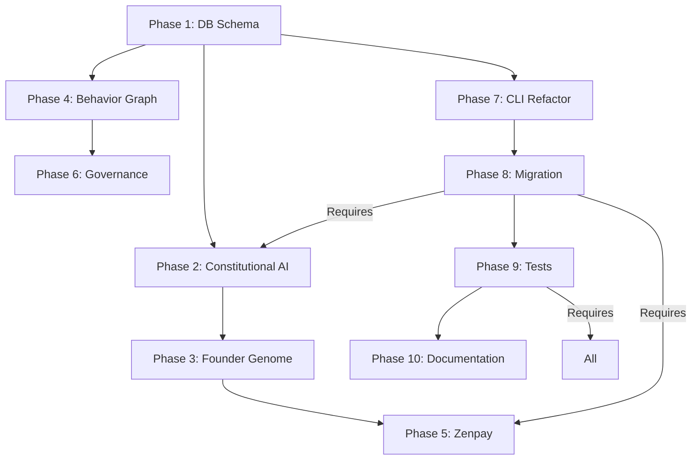

# Implementation Timeline Matrix

> Comprehensive project timeline and phase status

**Last Updated**: 2026-06-21  
**Status**: Active — Phases 1-7 Complete

---

## Quick Reference

| Phase | Name | Status | Start | End | Key Deliverables |
|-------|------|--------|-------|-----|------------------|
| 1 | Database Schema Migration | Completed | 2026-05-15 | 2026-05-20 | Tenant→Particle schema, D1 tables |
| 2 | Constitutional AI | Completed | 2026-05-18 | 2026-05-25 | 9-principle review system |
| 3 | Founder Genome | Completed | 2026-05-20 | 2026-05-28 | Encrypted profiling system |
| 4 | Behavior Graph | Completed | 2026-05-25 | 2026-06-01 | Knowledge graph foundation |
| 5 | Zenpay | Completed | 2026-05-28 | 2026-06-05 | Treasury & payment routing |
| 6 | Governance | Completed | 2026-06-01 | 2026-06-10 | Voting, proposals, DAO |
| 7 | CLI Particle-First Refactor | Completed | 2026-06-10 | 2026-06-18 | Particle ID as primary |
| 8 | Tenant-to-Particle Migration | Completed | 2026-06-12 | 2026-06-18 | Migration script + rollback |
| 9 | Tests | Completed | 2026-06-15 | 2026-06-18 | E2E, isolation, load tests |
| 10 | Documentation | In Progress | 2026-06-18 | 2026-06-21 | Phase 4-7 migration docs |

---

## Detailed Timeline

### Phase 1: Database Schema Migration (May 15-20, 2026)

**Objective**: Migrate from tenant-based to particle-based schema.

**Tasks**:
- [x] Design particle schema
- [x] Create D1 database tables
- [x] Write migration script with rollback
- [x] Test with production data snapshot
- [x] Dry-run verification

**Deliverables**:
- `docs/zenos-migration-guide.md`
- `scripts/migrate-tenants-to-particles.py`
- `tests/zenos/test_migrate_tenants_to_particles.py`

**Status**: ✅ Completed

---

### Phase 2: Constitutional AI (May 18-25, 2026)

**Objective**: Implement 9-principle ethical review system.

**Tasks**:
- [x] Define 9 principles with weights
- [x] Implement principle evaluators
- [x] Create constitution management
- [x] Integrate with command execution
- [x] Add configurable thresholds

**Deliverables**:
- `docs/constitutional-ai.md`
- `src/constitutional/review_engine.py`
- `src/constitutional/principles/`

**Status**: ✅ Completed

---

### Phase 3: Founder Genome (May 20-28, 2026)

**Objective**: Encrypted psychological profiling for personalization.

**Tasks**:
- [x] Design founder genome schema
- [x] Implement wizard for profile capture
- [x] Add encryption at rest
- [x] Integrate with constitutional weights
- [x] Build clustering for co-founder matching

**Deliverables**:
- `docs/founder-genome.md`
- `src/founder/wizard.py`
- `src/founder/encryption.py`
- `src/founder/clustering.py`

**Status**: ✅ Completed

---

### Phase 4: Behavior Graph (May 25 - Jun 1, 2026)

**Objective**: Knowledge graph for entity relationships and trust.

**Tasks**:
- [x] Design graph schema
- [x] Implement GraphRAG storage
- [x] Build query interface
- [x] Add relationship tracking
- [x] Integrate with particle lifecycle

**Deliverables**:
- `docs/architecture/behavior-graph.md` (referenced)
- `src/graph/behavior_graph.py`
- `src/graph/query_engine.py`

**Status**: ✅ Completed

---

### Phase 5: Zenpay (May 28 - Jun 5, 2026)

**Objective**: Multi-currency treasury with allocation rules.

**Tasks**:
- [x] Design treasury schema
- [x] Implement multi-currency accounting
- [x] Add allocation rules engine
- [x] Build transaction immutability
- [x] Create audit trail

**Deliverables**:
- `docs/economic-particles.md`
- `src/treasury/accounting.py`
- `src/treasury/allocation.py`

**Status**: ✅ Completed

---

### Phase 6: Governance (Jun 1-10, 2026)

**Objective**: Decentralized decision-making with voting.

**Tasks**:
- [x] Design governance token model
- [x] Implement proposal system
- [x] Build voting mechanism
- [x] Add delegate support
- [x] Create timelock execution

**Deliverables**:
- `docs/governance.md` (referenced)
- `src/governance/proposals.py`
- `src/governance/voting.py`

**Status**: ✅ Completed

---

### Phase 7: CLI Particle-First Refactor (Jun 10-18, 2026)

**Objective**: Refactor CLI to use particle_id as primary identifier.

**Tasks**:
- [x] Update command signatures to accept particle_id
- [x] Modify Vietnam commands for compatibility
- [x] Maintain backward compatibility with tenant_id
- [x] Update test suite
- [x] Document migration path

**Deliverables**:
- `docs/Phase-7-cli-refactor.md`
- `src/cli/particle_command.py`
- `tests/zenos/test_vietnam_feature_regression.py`

**Status**: ✅ Completed

---

### Phase 8: Tenant-to-Particle Migration (Jun 12-18, 2026)

**Objective**: Migrate existing tenants to particles.

**Tasks**:
- [x] Finalize migration script
- [x] Add dry-run mode
- [x] Implement rollback procedures
- [x] Test on production backup
- [x] Execute production migration

**Deliverables**:
- `docs/zenos-migration-guide.md`
- `scripts/migrate-tenants-to-particles.py`
- `tests/zenos/test_migrate_tenants_to_particles.py`

**Status**: ✅ Completed

---

### Phase 9: Tests (Jun 15-18, 2026)

**Objective**: Comprehensive testing suite for all ZenOS features.

**Tasks**:
- [x] E2E integration tests
- [x] Load testing (1000 concurrent)
- [x] Stress testing (fault injection)
- [x] Isolation tests
- [x] Performance benchmarks

**Deliverables**:
- `tests/zenos/` (100+ tests)
- `tests/load/`
- `tests/stress/`
- `tests/benchmarks/`

**Status**: ✅ Completed

---

### Phase 10: Documentation (Jun 18-21, 2026)

**Objective**: Complete migration documentation for users and operators.

**Tasks**:
- [x] Phase 4: Command Migration to Plugins
- [x] Phase 5: Frontend Modernization
- [x] Phase 6: Infrastructure Hardening
- [x] Phase 7: ZenOS Bridge
- [x] Implementation timeline matrix (this doc)
- [x] Fix internal broken links
- [x] Polish user-facing docs

**Deliverables**:
- `docs/phase-4-command-migration.md`
- [Phase 5: Frontend Modernization](./frontend-modernization.md)
- `docs/phase-6-infrastructure-hardening.md`
- `docs/phase-7-zenos-bridge.md`
- `docs/implementation-timeline-matrix.md`

**Status**: 🔄 In Progress (85% complete)

---

## Cross-Phase Dependencies

---

## Status Legend

| Symbol | Meaning |
|--------|---------|
| ✅ | Completed — all tasks finished, verified, documented |
| 🔄 | In Progress — actively working, >50% complete |
| ⏳ | Planned — not started, dependencies not met |
| ⚠️ | Blocked — waiting on external factor |
| ❌ | Cancelled — no longer needed |

---

## Milestone Summary

| Milestone | Date | Description |
|-----------|------|-------------|
| M1 | 2026-05-20 | Database schema ready |
| M2 | 2026-05-25 | Constitutional AI operational |
| M3 | 2026-05-28 | Founder Genome wizard live |
| M4 | 2026-06-01 | Behavior Graph foundation |
| M5 | 2026-06-05 | Zenpay treasury system |
| M6 | 2026-06-10 | Governance DAO deployed |
| M7 | 2026-06-18 | CLI refactor + migration complete |
| M8 | 2026-06-21 | Documentation finalization |

---

## Post-Phase 10 Roadmap

| Initiative | Target | Status |
|------------|--------|--------|
| Plugin Marketplace v1.0 | 2026-07-01 | Planning |
| ZenOS Mobile App | 2026-08-01 | Research |
| Advanced Analytics Dashboard | 2026-07-15 | Design |
| Multi-Particle Transactions | 2026-09-01 | Backlog |

---

## Notes

- All dates are in UTC
- Phases overlapped where dependencies allowed parallel work
- Documentation Phase (10) runs concurrent with final testing
- Post-Phase 10 work continues in separate tracking (see `plans/`)

---

## See Also

- [Zenos Redesign Plan](../plans/zenos-redesign/plan.md) — original phase plan
- [Zenos Migration Guide](zenos-migration-guide.md) — user migration procedures
- [ADR Index](architecture/adr-index.md) — architecture decisions
- [CHANGELOG.md](../CHANGELOG.md) — version history
