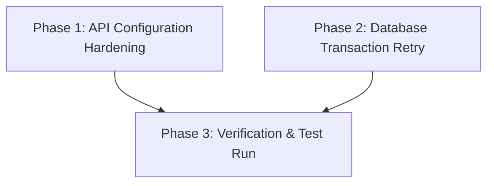

# Implementation Plan: Nhịp Điệu Xanh Production Hardening

This plan details the dynamic configuration of LLM server addresses and the integration of database transaction retries on transient errors.

## 1. File Ownership Matrix

| File Path | Owner Phase | Description |
|---|---|---|
| `packages/ask-core/src/retriever.ts` | Phase 1 | Retrieve model URL, token, and name from env variables with fallback |
| `apps/nhipdieuxanh/app/api/posts/route.ts` | Phase 1 | Dynamic LLM server URL, model name, and auth header in API route |
| `apps/nhipdieuxanh/lib/prisma.ts` | Phase 2 | Prisma Client extension implementation for transactions retry |
| `apps/nhipdieuxanh/tests/crm.test.ts` | Phase 3 | Verification test cases for API configurations and DB operations |

## 2. Dependency Matrix & Execution Strategy

- **Phase 1** & **Phase 2** can execute in **PARALLEL**.
- **Phase 3** is **SEQUENTIAL** and runs after Phase 1 and Phase 2 are complete.

## 3. Implementation Phases

- **Phase 1: API Configuration Hardening**
  - Path: [phase-01-api-config.md](file:///Users/macbook/mekong-cli/plans/260530-0440-production-hardening/phase-01-api-config.md)
  - Status: completed
- **Phase 2: Database Transaction Retry**
  - Path: [phase-02-db-retry.md](file:///Users/macbook/mekong-cli/plans/260530-0440-production-hardening/phase-02-db-retry.md)
  - Status: completed
- **Phase 3: Verification & Test Run**
  - Path: [phase-03-verification.md](file:///Users/macbook/mekong-cli/plans/260530-0440-production-hardening/phase-03-verification.md)
  - Status: completed
